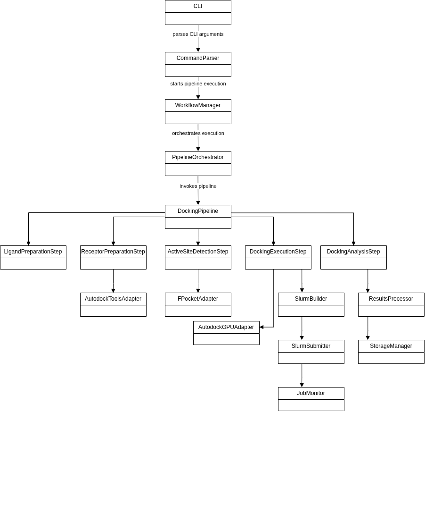
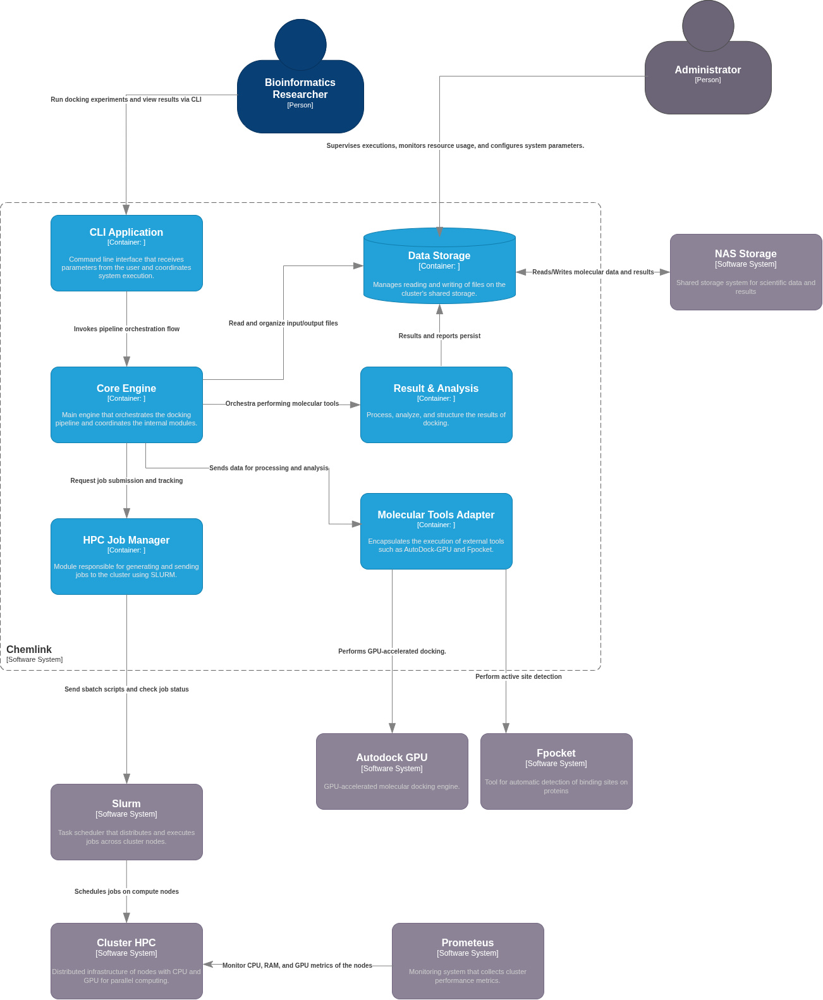
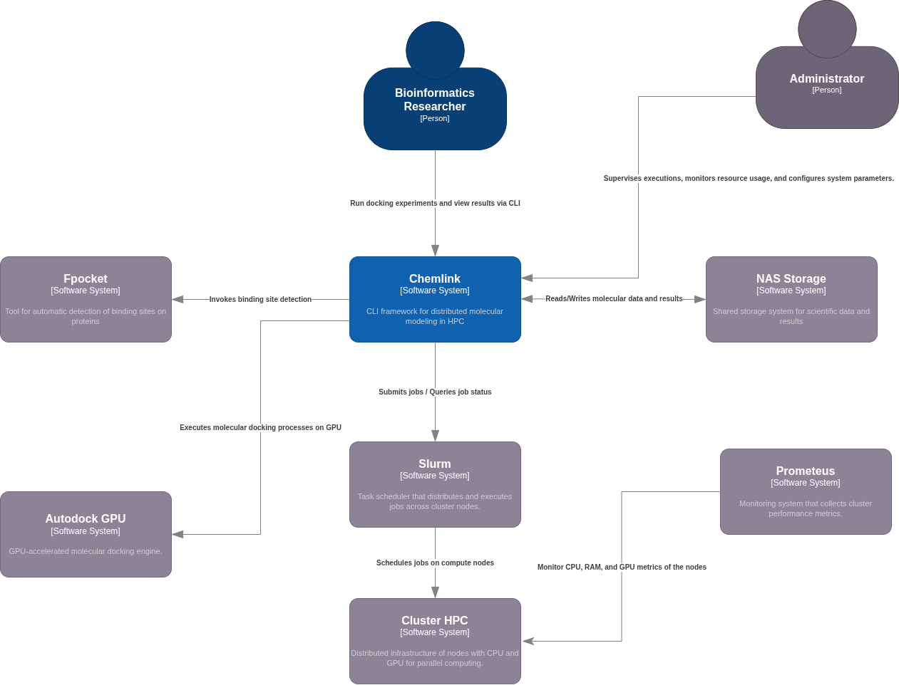
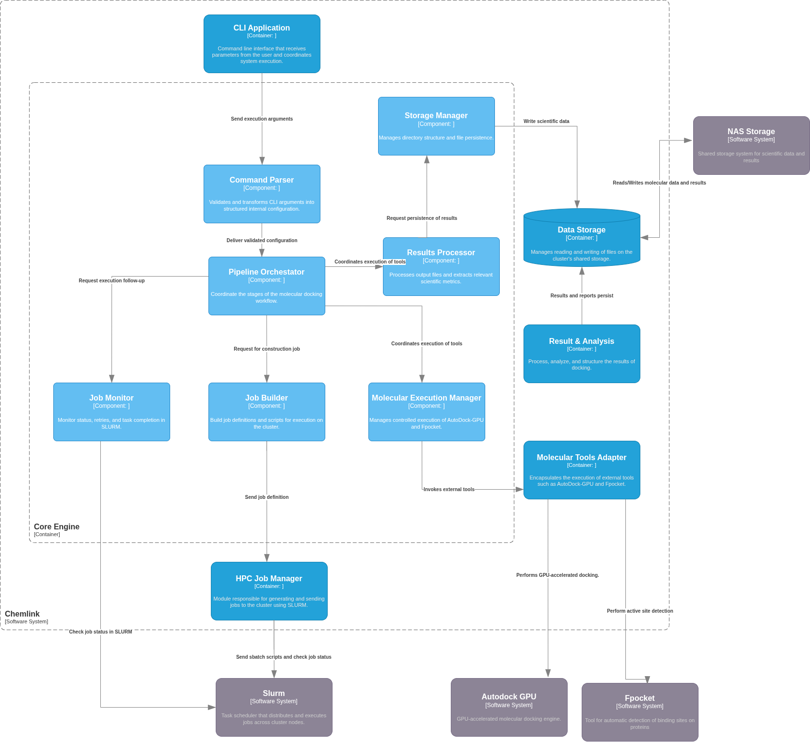

# Informe Tecnico del Proyecto ChemLink

Versión: 1.1  
Fecha: 2026-04-08

## Resumen

ChemLink es una plataforma CLI orientada a química computacional y ejecución distribuida en entornos HPC. Su propósito es automatizar pipelines de docking molecular para disminuir trabajo manual, mejorar reproducibilidad y aumentar el aprovechamiento de recursos CPU/GPU. El proyecto se desarrolla como trabajo de grado en Ingeniería de Sistemas con enfoque en arquitectura de software, HPC y sistemas distribuidos [I1][I2][I3].

## 1. Contexto del proyecto

La investigación en química computacional depende de la ejecución repetible de procesos intensivos en cómputo. En el contexto del laboratorio, el docking molecular requiere preparar estructuras, definir regiones de búsqueda, ejecutar simulaciones y consolidar resultados. Este flujo, cuando se realiza manualmente, consume tiempo operativo y aumenta la probabilidad de errores.

ChemLink surge como una solución de ingeniería para estandarizar y automatizar ese flujo mediante una interfaz de línea de comandos modular. El repositorio ya incorpora etapas de preparación de receptores, preparación de ligandos, detección de sitio activo, ejecución de docking y análisis posterior, junto con soporte de paralelismo local y base para ejecución en cluster con SLURM [I4][I5][I6].

## 2. Situación actual

Estado sintético del sistema:

- Existe una CLI funcional con una única capa de uso actual enfocada en docking.
- Comandos recomendados agrupados: `chemlink docking prepare`, `chemlink docking full`, `chemlink docking run`, `chemlink docking analyze`.
- Comandos legacy para compatibilidad: `receptor-preparation`, `ligand-preparation`, `active-site`, `docking-execution`, `docking-analysis`, `docking-pipeline` [I4][I5].
- El pipeline de docking implementa flujo de preparación y flujo completo (incluye ejecución y análisis) [I4].
- Hay soporte de defaults para rutas de entrada/salida y workers, lo que reduce la verbosidad de ejecución.
- Se integran herramientas externas clave (fpocket, MGLTools/AutoDockTools, AutoGrid4 y AutoDock-GPU) con adaptadores y etapas dedicadas [I2][I3].
- Hay capacidades de sharding para arreglos SLURM vía variables de entorno, útiles para despliegues multi-nodo [I6].
- Se habilitó comando local `chemlink` mediante launcher, con rutas por defecto y ayudas de comando documentadas [I5][I7].

## 3. Necesidad u oportunidad identificada que motiva el desarrollo de la solución

La necesidad principal es transformar un proceso de docking históricamente manual, fragmentado y sensible a error en un proceso repetible, trazable y escalable.

Oportunidades concretas:

- Reducir tiempo operativo por experimento al estandarizar la ejecución por línea de comandos.
- Elevar reproducibilidad al centralizar parámetros, estructura de carpetas y reportes.
- Mejorar el uso de infraestructura HPC existente con particionamiento de carga y ejecución distribuida.
- Facilitar transición de pruebas locales a ejecución en cluster y contenedores sin rediseñar la lógica científica.

Este enfoque se alinea con la necesidad de HTVS (high-throughput virtual screening), donde escalabilidad y consistencia de ejecución son determinantes [1][2][6].

## 4. Planteamiento del problema

### 4.1 Definición y delimitación del problema central

El problema central es la falta de una capa unificada de orquestación para docking molecular en un entorno HPC heterogéneo, lo que provoca ejecuciones manuales largas, configuraciones inconsistentes y dificultades de auditoría experimental.

Relevancia:

- Impacta productividad del laboratorio.
- Aumenta riesgo de errores de configuración.
- Dificulta comparación de resultados entre corridas.
- Limita la escalabilidad a escenarios multi-nodo.

### 4.2 Descripción del problema

En el flujo previo, cada etapa del docking se ejecuta como paso aislado y con parametrización manual. Esto produce:

- Acoplamiento operativo al conocimiento tácito del operador.
- Alto riesgo en rutas, formatos y binarios externos.
- Baja estandarización de logs, reportes y artefactos de salida.
- Dificultad para repetir experimentos con igualdad de condiciones.

### 4.3 Restricciones y supuestos de diseño

Restricciones:

- Dependencia de software científico de terceros (fpocket, MGLTools, AutoGrid4, AutoDock-GPU).
- Variabilidad de rutas y binarios entre host, contenedor y cluster.
- Disponibilidad desigual de CPU/GPU por nodo.
- Limitaciones operativas de laboratorio para pruebas prolongadas.

Supuestos:

- Linux como plataforma principal.
- Estructura de datos esperada en `data/input` y `data/output`.
- Existencia de entorno Python con dependencias científicas (por ejemplo RDKit) [I3].
- Uso de almacenamiento compartido (NAS) para escenarios distribuidos.

### 4.4 Alcance (lo que incluye y lo que no)

Incluye:

- CLI para ejecutar flujo de docking por etapas y flujo completo.
- Integración con herramientas de docking y post-análisis.
- Soporte de paralelismo local y particionamiento para SLURM.
- Reportes y logs de corrida.

No incluye:

- Desarrollo de nuevos algoritmos de docking.
- GUI web completa de producción.
- Administración física de infraestructura HPC.

## 5. Objetivos

### 5.1 Objetivo principal

Diseñar e implementar una plataforma CLI modular para automatizar y orquestar pipelines de docking molecular en entornos locales y HPC, garantizando reproducibilidad, trazabilidad y eficiencia computacional.

### 5.2 Objetivos específicos

1. Definir una arquitectura modular por capas que desacople orquestación, procesamiento molecular, almacenamiento e integraciones externas.
2. Implementar flujo completo de docking con etapas independientes y componibles.
3. Integrar soporte de ejecución distribuida por sharding y compatibilidad con SLURM.
4. Estandarizar configuración y defaults para reducir verbosidad y error humano.
5. Consolidar análisis de resultados en reportes estructurados.
6. Establecer plan de pruebas para validar funcionalidad, integración y usabilidad operativa.

## 6. Estado del arte

### 6.1 Herramientas de docking y pre/post-proceso

- AutoDock y AutoDock4 son referentes históricos para docking por funciones de scoring y búsqueda estocástica [1][2].
- AutoDock-GPU acelera el flujo para escenarios de alto volumen en arquitecturas modernas [3].
- fpocket se usa para detección geométrica de cavidades y apoyo en definición de región de docking [4].
- Open Babel y RDKit son piezas ampliamente usadas para conversión, curado y manejo de estructuras químicas [5][6].

### 6.2 Orquestación HPC y contenedores

- SLURM es estándar de facto para gestión de colas en HPC académico/industrial [7].
- Apptainer/Singularity es práctica recomendada para reproducibilidad en clusters donde Docker no siempre es viable en runtime [8].

### 6.3 Brecha frente al contexto local

Las herramientas individuales son robustas, pero el valor diferencial del proyecto está en su integración operativa:

- Uniformar entrada/salida y parametrización.
- Incorporar defaults orientados a ejecución real.
- Reducir curva de aprendizaje para usuarios del laboratorio.

## 7. Requerimientos

### 7.1 Requerimientos funcionales

RF-01. Ejecutar pipeline completo de docking desde CLI con un comando principal.  
RF-02. Ejecutar etapas individuales de preparación, ejecución y análisis.  
RF-03. Soportar modo de sitio activo automático y manual.  
RF-04. Permitir configuración de workers por etapa.  
RF-05. Detectar/aceptar rutas de binarios externos requeridos.  
RF-06. Generar reportes de análisis en formatos estructurados.  
RF-07. Proveer mensajes de error útiles y logs de ejecución.  
RF-08. Soportar particionamiento por variables de entorno para arreglos SLURM.

### 7.2 Requerimientos no funcionales

RNF-01. Reproducibilidad: misma entrada + mismos parámetros debe producir resultados comparables.  
RNF-02. Escalabilidad: soporte de ejecución local y distribuida.  
RNF-03. Usabilidad operativa: CLI clara, defaults sensatos y ayuda por comando.  
RNF-04. Mantenibilidad: estructura modular y separación de responsabilidades.  
RNF-05. Portabilidad: ejecución en host y contenedor (Docker/Apptainer).  
RNF-06. Observabilidad: logs y reportes por etapa para diagnóstico.

## 8. Diseño y arquitectura

### 8.1 Evaluación de alternativas

Alternativa A: scripts monolíticos por etapa sin orquestador central.  
- Ventaja: implementación rápida inicial.  
- Desventaja: acoplamiento alto, baja mantenibilidad, repetición de lógica.

Alternativa B: CLI modular por comandos con pipeline orquestado (opción adoptada).  
- Ventaja: extensibilidad, claridad de responsabilidades, mejor trazabilidad.  
- Desventaja: mayor esfuerzo inicial de estructura.

Alternativa C: API web como puerta principal desde el inicio.  
- Ventaja: accesibilidad para usuarios no técnicos.  
- Desventaja: complejiza seguridad, operación y debugging en etapa temprana.

La decisión es adoptar B como base y dejar C como evolución posterior para una capa de autoservicio.

### 8.2 Arquitectura

La arquitectura implementada sigue un enfoque por capas y componentes:

- CLI: parsing, defaults y UX de comandos.
- Pipeline: coordinación de etapas y validación de precondiciones.
- Steps: lógica operativa por etapa del docking.
- Utils/Storage: utilidades comunes y operaciones de archivos.
- Adapters: encapsulación de interacción con herramientas externas.
- HPC: scripts de soporte para ejecución por scheduler.

Esta descomposición minimiza acoplamiento y facilita pruebas unitarias por componente [I2][I4].

### 8.3 Diagramas de arquitectura

La solución se documenta además con los siguientes diagramas, reutilizados desde el primer informe y almacenados en [`informes/images`](informes/images).

#### Diagrama de contexto

Este diagrama resume el entorno general de ChemLink, los actores del sistema y su interacción con el ecosistema HPC y las herramientas científicas externas.

#### Diagrama de contenedores

Este diagrama muestra la distribución lógica de los principales contenedores funcionales del sistema, incluyendo la CLI, el pipeline y los módulos de soporte.

#### Diagrama C1

Este diagrama presenta la vista de contexto ampliada y ayuda a entender cómo se relaciona el usuario con la orquestación del pipeline y la infraestructura de ejecución.

#### Diagrama de componentes

Este diagrama detalla la descomposición interna del sistema en componentes reutilizables, alineada con la arquitectura modular del código fuente.

## 9. Implementación

### 9.1 Stack tecnológico

- Lenguaje principal: Python 3.
- CLI: argparse (nativo), con jerarquía de comandos y aliases.
- Dependencias científicas: RDKit, NumPy, tqdm y utilitarios de sistema [I3].
- Toolchain externa: fpocket, MGLTools/AutoDockTools, AutoGrid4, AutoDock-GPU.
- Infraestructura objetivo: Linux, SLURM y almacenamiento compartido NAS.
- Contenedores: Docker/Apptainer para empaquetado reproducible.

### 9.2 Componentes

Componentes funcionales principales:

- ReceptorPreparation
- LigandPreparation
- ActiveSiteDetection
- DockingExecution
- DockingAnalysis
- DockingPipeline (orquestador)
- CLI principal y comandos agrupados/legacy

Componentes de soporte:

- logger, validadores y manejo de archivos
- scripts SLURM para escenarios distribuidos

### 9.3 Integraciones

Integraciones críticas:

- Resolución de ejecutables de docking por PATH/rutas explícitas.
- Conversor y preparador molecular en preproceso.
- Generación de archivos de grid y ejecución GPU.
- Recolección y consolidación de resultados para analítica final.

## 10. Plan de pruebas

### 10.1 Pruebas por componentes

Objetivo: validar cada etapa de forma aislada.

- Preparación de receptores: entradas válidas/ inválidas, errores de binario, salida esperada.
- Preparación de ligandos: formatos múltiples, partición de archivos multi-molécula, advertencias.
- Detección de sitio activo: modo automático vs manual, fallback de rutas fpocket.
- Ejecución docking: detección de mapas/gpf, comportamiento con workers, manejo de fallos.
- Análisis: parseo de resultados, consistencia de reportes.

Criterio de aceptación:

- Cada componente retorna estadísticas esperadas y artefactos de salida correctos.

### 10.2 Pruebas de integración

Objetivo: verificar continuidad del pipeline end-to-end.

Escenarios mínimos:

1. Flujo completo con defaults: `chemlink docking full`.
2. Flujo completo con parámetros manuales de caja.
3. Flujo por etapas (`prepare`, `run`, `analyze`) con salida intermedia existente.
4. Ejecución en contenedor con rutas de binarios no estándar.
5. Ejecución en entorno SLURM con sharding por arreglo.

Métricas de observación:

- Tiempo por etapa.
- Tasa de éxito por etapa.
- Número de errores recuperables/no recuperables.
- Integridad de reportes finales.

### 10.3 Pruebas de usabilidad

Objetivo: evaluar facilidad de adopción por usuarios del laboratorio.

Criterios:

- Tiempo de primera ejecución exitosa por usuario nuevo.
- Cantidad de flags requeridos en escenario común.
- Comprensión de mensajes de ayuda y errores.
- Satisfacción operativa (encuesta corta Likert 1-5).

Propuesta de protocolo:

- Grupo piloto de usuarios del laboratorio.
- Tareas estandarizadas (ejecutar full, revisar reporte, repetir corrida).
- Registro de bloqueos y mejoras sugeridas para backlog CLI.

## 11. Conclusiones técnicas

El proyecto muestra una base madura para operación real en laboratorio: la CLI ya permite uso menos verboso con defaults, existe pipeline completo y se dispone de base HPC para escalar. La principal recomendación de corto plazo es consolidar la documentación operativa (comandos + despliegue en contenedor/cluster), cerrar brechas menores de robustez en integraciones externas y formalizar la batería de pruebas para medir impacto en productividad y reproducibilidad.

## 12. Referencias

### Referencias externas

[1] G. M. Morris et al., AutoDock4 and AutoDockTools4: Automated docking with selective receptor flexibility, Journal of Computational Chemistry, 2009.  
[2] R. Huey et al., A semiempirical free energy force field with charge-based desolvation, Journal of Computational Chemistry, 2007.  
[3] S. Santos-Martins et al., Accelerating AutoDock4 with GPUs and gradient-based local search, Journal of Chemical Theory and Computation, 2021.  
[4] V. Le Guilloux, P. Schmidtke, P. Tuffery, Fpocket: An open source platform for ligand pocket detection, BMC Bioinformatics, 2009.  
[5] N. M. O'Boyle et al., Open Babel: An open chemical toolbox, Journal of Cheminformatics, 2011.  
[6] G. Landrum et al., RDKit: Open-source cheminformatics; documentation and project resources, https://www.rdkit.org/  
[7] SchedMD, Slurm Workload Manager Documentation, https://slurm.schedmd.com/documentation.html  
[8] Apptainer Project, Apptainer User Guide, https://apptainer.org/docs/

### Referencias internas del proyecto

[I1] README del proyecto ChemLink: /home/pipe/Universidad/proyecto_final/chemlink/README.md  
[I2] Documento de arquitectura: /home/pipe/Universidad/proyecto_final/chemlink/ARCHITECTURE.md  
[I3] Dependencias Python: /home/pipe/Universidad/proyecto_final/chemlink/requirements.txt  
[I4] Orquestador de pipeline: /home/pipe/Universidad/proyecto_final/chemlink/pipelines/docking/docking_pipeline.py  
[I5] Referencia de comandos: /home/pipe/Universidad/proyecto_final/chemlink/command.md  
[I6] Soporte SLURM: /home/pipe/Universidad/proyecto_final/chemlink/hpc/slurm/README.md  
[I7] Entrada CLI principal: /home/pipe/Universidad/proyecto_final/chemlink/cli/main.py
