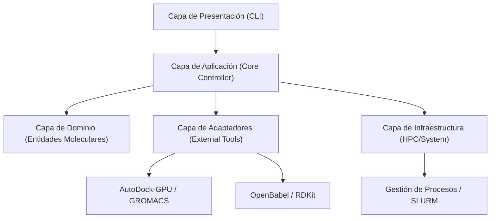

# ChemLink: Framework CLI Integral para Modelado Molecular Distribuido en Cluster HPC


**ChemLink** es una solución de ingeniería de software diseñada para automatizar, orquestar y optimizar flujos de trabajo de química computacional (específicamente *Docking Molecular* y *Dinámica Molecular*) en entornos de Computación de Alto Desempeño (HPC).

Este proyecto representa el **Trabajo de Final de Grado** para el programa de **Ingeniería de Sistemas (2026-10)**, desarrollado bajo la línea de investigación en **Computación de Alto Desempeño, Arquitectura de Software y Sistemas Distribuidos**.

---

## 📑 Tabla de Contenidos

1.  [Introducción](#1-introducción)
2.  [Planteamiento del Problema](#2-planteamiento-del-problema)
3.  [Objetivos del Proyecto](#3-objetivos-del-proyecto)
4.  [Alcance y Funcionalidades](#4-alcance-y-funcionalidades)
5.  [Arquitectura del Sistema](#5-arquitectura-del-sistema)
6.  [Restricciones y Supuestos de Diseño](#6-restricciones-y-supuestos-de-diseño)
7.  [Stack Tecnológico](#7-stack-tecnológico)
8.  [Instalación y Uso](#8-instalación-y-uso)
9.  [Créditos](#9-créditos)

---

## 1. Introducción

La investigación en química computacional depende intrínsecamente de la capacidad de procesar modelos moleculares complejos mediante simulaciones masivas. En el contexto actual, el descubrimiento de fármacos *in silico* requiere una orquestación precisa de recursos de hardware.

**ChemLink** nace como respuesta a la necesidad operativa del laboratorio **Chemlab**, proponiendo un *framework* de interfaz de línea de comandos (CLI) modular. Su propósito es abstraer la complejidad del manejo de clusters HPC basados en **Ubuntu 24.04 LTS**, permitiendo a los investigadores ejecutar pipelines de *docking* molecular de manera distribuida, validada y reproducible.

Al integrar la detección automática de sitios de unión, la paralelización dinámica de tareas y la generación estructurada de reportes, ChemLink transforma un proceso manual y propenso a errores en una línea de producción científica robusta y escalable.

---

## 2. Planteamiento del Problema

El laboratorio Chemlab dispone de una infraestructura HPC moderna con nodos equipados con aceleración por GPU. No obstante, el flujo de trabajo actual presenta desafíos críticos que limitan la producción científica:

*   **Fragmentación del Flujo de Trabajo:** Los investigadores ejecutan manualmente múltiples herramientas dispares (preparación de ligandos, configuración de *grid boxes*, ejecución de `autodock-gpu`), rompiendo la continuidad del experimento y aumentando el error humano.
*   **Subutilización de Recursos:** La asignación estática y manual de trabajos a las GPUs provoca tiempos de inactividad en los nodos o cuellos de botella, desperdiciando la potencia de cálculo instalada.
*   **Falta de Trazabilidad y Reproducibilidad:** La gestión manual de archivos de entrada y salida genera una dispersión de datos que complica la auditoría. No existe garantía de que un experimento pueda ser replicado con exactitud bajo las mismas condiciones.
*   **Escalabilidad Limitada:** El enfoque actual hace inviable la realización de campañas de Cribado Virtual de Alto Rendimiento (*High-Throughput Virtual Screening - HTVS*) de manera eficiente.

---

## 3. Objetivos del Proyecto

### Objetivo General
Diseñar e implementar **ChemLink**, una plataforma CLI científica, modular y orientada a HPC que automatice y optimice la ejecución de experimentos de *docking* y dinámica molecular en un cluster distribuido, garantizando la gestión adaptativa de recursos (CPU/GPU), la paralelización eficiente y la trazabilidad experimental.

### Objetivos Específicos
1.  **Arquitectura Modular:** Diseñar una arquitectura de software en capas (*CLI, Core, Adapters, Utils*) que desacople la lógica de negocio de las herramientas científicas subyacentes.
2.  **Automatización del Pipeline:** Implementar la automatización *end-to-end*: detección automática de sitios de unión, generación dinámica de cajas, preparación de inputs y ejecución.
3.  **Ejecución Híbrida:** Desarrollar un sistema que soporte tanto el multiprocesamiento local como la generación automática de scripts de trabajo para gestores de colas (SLURM) en el cluster.
4.  **Gestión de Recursos y Tolerancia a Fallos:** Integrar validaciones de hardware (disponibilidad de GPU/Memoria) y mecanismos de recuperación ante *timeouts* o errores de ejecución.
5.  **Análisis Estructurado:** Implementar módulos de post-procesamiento para el cálculo de afinidad, RMSD y generación de reportes (CSV, JSON, Markdown).
6.  **Validación de Desempeño:** Evaluar el impacto de la solución mediante métricas de *Speedup*, Eficiencia Computacional y Tasa de Éxito frente al método manual.

---

## 4. Alcance y Funcionalidades

El proyecto abarca el ciclo de vida completo de ingeniería de software para ChemLink, desde el diseño arquitectónico hasta la validación en entorno real.

### Incluido (In Scope)
*   **Interfaz CLI Robusta:** Comandos intuitivos (`chemlink run`, `chemlink analyze`) optimizados para entornos *headless*.
*   **Wrappers de Docking:** Integración nativa con **AutoDock-GPU** y **Vina**.
*   **Preparación de Ligandos:** Conversión automática y validación de formatos moleculares (PDB $\leftrightarrow$ PDBQT).
*   **Distribución de Carga:** Balanceo dinámico de trabajos entre las GPUs disponibles.
*   **Sistema de Reportes:** Generación automática de tablas comparativas y rankings de mejores candidatos.
*   **Logging Estructurado:** Registro detallado de operaciones para auditoría y depuración.

### Excluido (Out of Scope)
*   Desarrollo de nuevos algoritmos de física cuántica o mecánica molecular (se orquestan los existentes).
*   Implementación de Interfaces Gráficas de Usuario (GUI) o dashboards web.
*   Mantenimiento físico o actualización de hardware del cluster.

---

## 5. Arquitectura del Sistema

ChemLink sigue un patrón arquitectónico de **Capas (Layered Architecture)** para asegurar la mantenibilidad, testabilidad y escalabilidad futura del sistema.



---

## 8. Instalación y Uso

### 8.1 Ejecución del CLI

Desde la carpeta raíz del proyecto:

```bash
python cli/main.py --help
```

También puedes usar:

```bash
python -m chemlink.cli.main --help
```

### 8.2 Preparar estructura mínima para pruebas

```bash
mkdir -p data/input/receptors
mkdir -p data/input/ligands
mkdir -p data/output
```

- `data/input/receptors`: archivos receptor `.pdb`
- `data/input/ligands`: archivos ligando (`.sdf`, `.mol2`, `.pdb`, `.mol` o `.pdbqt`)
- `data/output`: salida general del pipeline

### 8.3 Comandos disponibles

1. `receptor-preparation`

```bash
python cli/main.py receptor-preparation \
    data/input/receptors \
    data/output \
    --mgltools-path /opt/mgltools \
    --workers 4
```

2. `ligand-preparation`

```bash
python cli/main.py ligand-preparation \
    data/input/ligands \
    data/output \
    --workers 4
```

3. `active-site` (modo automático con fpocket)

```bash
python cli/main.py active-site \
    data/output/prepared_receptors_pdbqt \
    data/output/prepared_ligands_pdbqt \
    data/output \
    --mgltools-path /opt/mgltools \
    --fpocket-path /usr/bin/fpocket \
    --workers 4
```

4. `active-site` (modo manual)

```bash
python cli/main.py active-site \
    data/output/prepared_receptors_pdbqt \
    data/output/prepared_ligands_pdbqt \
    data/output \
    --mgltools-path /opt/mgltools \
    --manual-center 20 -16 -22 \
    --manual-npts 60 60 60 \
    --workers 4
```

5. `docking-execution`

```bash
python cli/main.py docking-execution \
    data/output/prepared_receptors_pdbqt \
    data/output/prepared_ligands_pdbqt \
    data/output \
    --autogrid-executable autogrid4 \
    --autodock-gpu-executable ./funciones/Aplicaciones/adgpu-v1.6_linux_x64_cuda12_128wi \
    --workers 2
```

6. `docking-analysis`

```bash
python cli/main.py docking-analysis data/output
```

7. `docking-pipeline` (preparación completa: receptor + ligando + active-site)

```bash
python cli/main.py docking-pipeline \
    data/input/receptors \
    data/input/ligands \
    data/output \
    --mgltools-path /opt/mgltools \
    --fpocket-path /usr/bin/fpocket \
    --receptor-workers 4 \
    --ligand-workers 4 \
    --active-site-workers 4
```

### 8.4 Flujo recomendado para probar end-to-end

```bash
# 1) Preparación de receptores
python cli/main.py receptor-preparation data/input/receptors data/output --mgltools-path /opt/mgltools --workers 4

# 2) Preparación de ligandos
python cli/main.py ligand-preparation data/input/ligands data/output --workers 4

# 3) Detección de sitio activo y generación de GPF
python cli/main.py active-site data/output/prepared_receptors_pdbqt data/output/prepared_ligands_pdbqt data/output --mgltools-path /opt/mgltools --fpocket-path /usr/bin/fpocket --workers 4

# 4) Ejecución de docking
python cli/main.py docking-execution data/output/prepared_receptors_pdbqt data/output/prepared_ligands_pdbqt data/output --autogrid-executable autogrid4 --autodock-gpu-executable ./funciones/Aplicaciones/adgpu-v1.6_linux_x64_cuda12_128wi --workers 2

# 5) Análisis de resultados
python cli/main.py docking-analysis data/output
```

### 8.5 Archivos de salida esperados

- `data/output/prepared_receptors_pdbqt/`: receptores preparados + `.gpf` y mapas
- `data/output/prepared_ligands_pdbqt/`: ligandos preparados
- `data/output/ResultadosDocking/`: resultados por proteína (`dlg`, `xml`, `affinity.dat`)
- `data/output/AnalisisDocking/`: `resumen_analisis.txt`, `resumen_analisis.csv`, `resumen_analisis.md`
- `data/output/docking_molecular.log`: log general de ejecución

### 8.6 Ayuda rápida

```bash
python cli/main.py --help
python cli/main.py receptor-preparation --help
python cli/main.py ligand-preparation --help
python cli/main.py active-site --help
python cli/main.py docking-execution --help
python cli/main.py docking-analysis --help
python cli/main.py docking-pipeline --help
```
