# ChemLink: Plataforma de Orquestación para Docking Molecular y Dinámicas Moleculares en Entornos HPC

---

## 1. Introducción

En laboratorios de química computacional de escala reducida, el acceso a infraestructura de Computación de Alto Rendimiento (HPC) suele ser limitado o fragmentario. Antes de ChemLink, el trabajo experimental se desarrollaba sobre una única estación de cómputo y con una lógica esencialmente secuencial: cada etapa debía completarse manualmente antes de iniciar la siguiente, lo que alargaba los tiempos de experimentación, aumentaba la dependencia del operador y dificultaba la repetibilidad del proceso.

En el laboratorio computacional de química y biología de la Universidad del Norte esta situación era especialmente visible. El flujo de trabajo combinaba herramientas aisladas, scripts de apoyo y ejecuciones manuales de receptores, ligandos, mapas de afinidad y simulaciones de dinámica molecular. Aunque existían varios equipos y aceleradores gráficos disponibles, la ausencia de una capa de orquestación impedía distribuir la carga entre nodos, controlar colas de ejecución y conservar un registro coherente de parámetros, rutas y resultados.

Esa condición previa definía con claridad el problema a resolver: el laboratorio contaba con capacidad de cómputo subutilizada, pero no con un sistema capaz de coordinarla de manera automática, segura y trazable. ChemLink surge precisamente para cubrir esa brecha mediante una plataforma modular que integra la preparación, ejecución y análisis de flujos de docking y dinámica molecular. Su aporte no consiste en añadir más herramientas, sino en convertir una infraestructura dispersa en un proceso científico gobernado por reglas, con mayor eficiencia operativa y mejor control de la reproducibilidad.

Para que esa plataforma pudiera operar de forma distribuida, fue necesario construir primero el sustrato físico que la sostiene. El proyecto incluyó la organización del clúster HPC —un nodo manager y nodos worker con aceleradores NVIDIA—, la configuración de una red privada con direcciones estáticas y acceso seguro entre nodos mediante criptografía RSA, el despliegue de OpenMediaVault como servidor de almacenamiento en red con un volumen NFS montado uniformemente en todos los nodos, la instalación de SLURM como gestor de colas y recursos, y la puesta en marcha de una pila de monitoreo basada en Prometheus y Grafana para mantener visibilidad operacional continua sobre el estado del hardware durante las campañas. Sin esa capa de infraestructura, la orquestación distribuida no habría sido posible; ambas capas —infraestructura y software— son partes inseparables del mismo proyecto.

Sobre ese clúster, ChemLink automatiza dos flujos experimentales complementarios. El pipeline de docking coordina la detección del sitio activo con fpocket, la preparación paralela de receptores y ligandos mediante MGLTools, la generación de mapas de afinidad con AutoGrid4 y la ejecución de búsquedas conformacionales en GPU con AutoDock-GPU, consolidando los resultados en rankings y candidatos para etapas posteriores. El pipeline de dinámica molecular estructura la simulación completa con GROMACS desde la preparación de topologías hasta el análisis de trayectorias, soportando seis tipos de sistemas biológicos y ajustando automáticamente los parámetros de ejecución al hardware disponible. Ambos pipelines operan bajo una interfaz de línea de comandos unificada en modo nodo único o distribuido, con el mismo nivel de trazabilidad y reproducibilidad en cualquier configuración.

---

## 2. Marco conceptual

Para comprender la arquitectura de ChemLink es necesario profundizar en los fundamentos fisicoquímicos, matemáticos y de ciencias de la computación que rigen las simulaciones moleculares de alto rendimiento.

### 2.1 Termodinámica y Algoritmos de Acoplamiento Molecular (Docking)

El docking molecular es un problema de optimización no lineal en un espacio continuo hiperdimensional, cuyo propósito es predecir la pose de unión (*binding pose*) termodinámicamente más favorable de un ligando flexible dentro de la cavidad activa de un receptor macromolecular [1]. Físicamente, el proceso está gobernado por el cambio en la energía libre de Gibbs del sistema al formarse el complejo ligando-receptor (ΔG_bind), el cual determina la constante de asociación del complejo mediante la ecuación fundamental de la termodinámica química:

$$\Delta G_{\text{bind}} = \Delta H_{\text{bind}} - T\Delta S_{\text{bind}}$$

Donde ΔH_bind representa la variación entálpica de la interacción, T es la temperatura absoluta del sistema y ΔS_bind es la pérdida de entropía conformacional debida a la restricción de los grados de libertad rotacionales del ligando tras el acoplamiento.

Para evaluar cuantitativamente esta energía libre en fracciones de segundo, el motor de cálculo utiliza un campo de fuerzas semi-empírico que descompone el cambio total en varios términos de interacción aditivos, calibrados mediante regresión lineal sobre bases de datos experimentales [1]:

$$\Delta G_{\text{bind}} = \Delta V_{\text{vdW}} + \Delta V_{\text{hbond}} + \Delta V_{\text{elec}} + \Delta G_{\text{desolv}} + \Delta S_{\text{tor}} N_{\text{tor}}$$

Este modelo matemático evalúa de forma separada cada fuerza intermolecular e intramolecular atómica. El término de van der Waals (ΔV_vdW) cuantifica las interacciones no enlazantes de corto alcance, representando la repulsión estérica entre nubes electrónicas y la atracción por fuerzas de dispersión de London. El término de puentes de hidrógeno (ΔV_hbond) evalúa específicamente la energía asociada a los enlaces de hidrógeno direccionales formados en el sitio activo. La interacción coulómbica clásica (ΔV_elec) calcula las fuerzas electrostáticas que actúan entre las cargas parciales de los átomos, considerando una constante dieléctrica variable para simular el apantallamiento que ejerce el solvente. El término de solvatación (ΔG_desolv) estima el efecto hidrofóbico, es decir, el beneficio energético obtenido al liberar las moléculas de agua estructuradas cuando las superficies apolares del ligando y del receptor entran en contacto. Finalmente, la entropía rotacional (ΔS_tor · N_tor) equilibra el cálculo penalizando la afinidad de forma proporcional al número de enlaces rotables libres del ligando, reflejando los grados de libertad conformacionales restringidos tras el acoplamiento.

Para resolver este paisaje energético altamente irregular y evitar mínimos locales, se recurre al **Algoritmo Genético Lamarckiano (LGA)** [1]. El LGA mapea la conformación y orientación espacial del ligando como un genotipo o vector de números reales que codifica traslaciones tridimensionales, orientaciones de Euler y los ángulos diedros torsionales de los enlaces flexibles del compuesto. El algoritmo combina una optimización global de tipo evolutivo —mutaciones, cruzamiento de genes y selección natural— con una optimización local individual de tipo fenotípico. Bajo el postulado lamarckiano, las coordenadas optimizadas por la búsqueda local en cada generación se traducen de vuelta al genotipo, transmitiendo de forma hereditaria las mejoras a las siguientes generaciones de la población.

En la fase de optimización local, AutoDock-GPU implementa dos aproximaciones algorítmicas críticas. La primera es **Solis-Wets**, un método estocástico de búsqueda directa que añade variaciones aleatorias a los genes, ajustando el tamaño del paso de exploración de forma dinámica basándose en una tasa histórica de aciertos o fracasos continuos. La segunda es **ADADELTA**, un optimizador determinista basado en gradientes que calcula analítica y numéricamente las derivadas primeras de la función de puntuación respecto a las coordenadas espaciales del ligando, acelerando drásticamente la convergencia y reduciendo significativamente el número de evaluaciones energéticas necesarias en ligandos de alta flexibilidad [1].

### 2.2 Dinámica Molecular de Alto Rendimiento y Paralelización Heterogénea

La dinámica molecular complementa la aproximación estática del docking al simular la evolución temporal y la flexibilidad conformacional del complejo biomolecular en disolución acuosa bajo condiciones fisiológicas [2]. A diferencia del docking, la dinámica molecular calcula la trayectoria tridimensional de cada átomo resolviendo iterativamente por integración numérica las ecuaciones de movimiento clásico de Newton:

$$F_i = m_i \frac{d^2 r_i}{dt^2} = -\nabla_i V(r_1, r_2, \ldots, r_N)$$

Donde F_i es la fuerza instantánea neta que actúa sobre el átomo i, m_i es su masa atómica, r_i es su vector de posición y V(r_1, r_2, …, r_N) es el potencial de energía potencial empírico parametrizado por un campo de fuerzas atómico.

Para alcanzar escalas temporales biológicamente relevantes, motores de simulación avanzados como GROMACS implementan estrategias de paralelismo heterogéneo multinivel y descomposición espacial de dominios [2]. El volumen de simulación se subdivide espacialmente en una cuadrícula tridimensional de subdominios balanceados dinámicamente, donde cada subdominio se asigna a un rango MPI y los nodos se comunican mediante pasos de mensajes asíncronos para actualizar las coordenadas en las fronteras de los subdominios.

El rendimiento informático se maximiza dividiendo las tareas computacionales basándose en la naturaleza física de las interacciones. Los cálculos de corto rango —las fuerzas no enlazantes de van der Waals y la porción real de las fuerzas electrostáticas— se descargan de forma asíncrona a las GPUs de paralelismo masivo, organizándolas mediante algoritmos de cúmulos de Verlet para evitar el costoso reordenamiento de registros en hilos de GPU [10]. Por su parte, la electrostática de largo alcance se modela mediante el algoritmo de interpolación de malla de partículas de Ewald (Particle Mesh Ewald o PME). GROMACS utiliza rangos MPI dedicados en CPU exclusivamente para realizar las transformadas tridimensionales rápidas de Fourier (3D-FFT), desacoplándolas del cálculo real de corto alcance en GPU para evitar que la latencia de red de las comunicaciones globales degrade la aceleración por hardware [11].

### 2.3 Orquestación, Administración de Clústeres y Workflow Management Systems (WMS)

En la capa de ingeniería de sistemas de alto rendimiento, la ejecución coordinada de estas complejas simulaciones distribuidas requiere de abstracciones lógicas de software para superar las limitaciones de la infraestructura física [3]. El gestor de colas y planificador de recursos SLURM actúa en la capa más baja de la infraestructura, encargándose de la contabilidad, priorización y asignación dinámica de procesadores, memoria RAM y aceleradores gráficos de forma aislada para cada proceso científico [2]. Para screenings virtuales y simulaciones de dinámica en masa, SLURM implementa los Job Arrays, un mecanismo nativo que permite instanciar miles de subtareas idénticas parametrizadas por un único índice, reduciendo la latencia de planificación y la sobrecarga sobre el controlador del clúster [4] [5].

Para articular y estructurar la secuencia lógica de pasos experimentales de forma robusta, se implementan los sistemas de gestión de flujos de trabajo científicos (WMS). Un WMS define un pipeline experimental como un Grafo Dirigido Acíclico (DAG), donde los vértices representan pasos de procesamiento computacional y las aristas dirigidas modelan las dependencias deterministas de entrada/salida de datos [6].

Los dos modelos lógicos de WMS más extendidos en la bioinformática moderna se basan en paradigmas fundamentalmente opuestos [6] [23]. **Nextflow** se basa en el paradigma dataflow interactivo, donde las tareas se comunican de forma exclusiva a través de canales asíncronos unidireccionales. Los procesos lógicos se ejecutan de manera puramente reactiva en el instante exacto en que sus canales de entrada reciben tokens de datos, posibilitando una paralelización implícita extremadamente eficiente, tolerancia a fallos nativa mediante el almacenamiento en caché de estados intermedios y una portabilidad absoluta entre diferentes clústeres HPC. **Snakemake**, por su parte, se basa en el paradigma del clásico utilitario GNU Make [7]. En lugar de declarar flujos explícitos, define reglas compuestas por nombres específicos de archivos de entrada y salida, utilizando un motor de emparejamiento de patrones con comodines. El motor de ejecución evalúa el DAG de atrás hacia adelante —desde el archivo objetivo final hasta los insumos iniciales—, determinando qué reglas deben ejecutarse basándose estrictamente en la existencia y las marcas de tiempo de modificación de los archivos físicos en el almacenamiento compartido.

El "vacío de orquestación" identificado en los laboratorios académicos tradicionales surge precisamente porque ni los motores de cálculo (GROMACS, AutoDock), ni el gestor de colas (SLURM), ni las herramientas de monitoreo físico (Prometheus) integran de forma nativa estas capas en un entorno unificado. ChemLink se diseña bajo este marco teórico para actuar como la capa integradora ausente, administrando la comunicación segura bajo Secure Shell (SSH) sin contraseña mediante criptografía RSA, montando de manera transparente sistemas de almacenamiento distribuido en red (NAS) sobre NFS para la persistencia del grafo de tareas, y automatizando las transformaciones de datos entre cada hito del pipeline.

### 2.4 Almacenamiento Distribuido en Red: NFS y SMB/CIFS/Samba

El almacenamiento compartido entre nodos es un requisito estructural de cualquier clúster HPC, pero los protocolos disponibles responden a necesidades de uso distintas. **NFS** (*Network File System*), estabilizado en su versión 4.2 con semántica *close-to-open*, provee acceso POSIX transparente a un volumen remoto: los procesos de cómputo en nodos workers leen y escriben archivos como si estuvieran en el disco local, mientras el servidor mantiene coherencia de metadatos sin sincronización explícita en el código del usuario. Esta propiedad es fundamental en HPC porque permite que decenas de tareas distribuidas accedan simultáneamente a las mismas entradas, artefactos intermedios y resultados sin coordinación adicional entre los procesos.

**SMB/CIFS/Samba** (*Server Message Block / Common Internet File System*, implementado en entornos Linux mediante el servidor **Samba**), en contraste, está concebido para un dominio de uso diferente: el almacenamiento personal y colaborativo. SMB/CIFS/Samba ofrece control de acceso por usuario, soporte nativo para clientes Windows y macOS, cuotas, instantáneas y políticas de backup centralizadas que NFS no expone de forma nativa. Por ello, en infraestructuras de laboratorio es habitual desplegar ambos protocolos con propósitos bien delimitados: NFS para el flujo de datos de cómputo, y SMB/CIFS/Samba para el almacenamiento personal de los investigadores, los repositorios de reserva y las copias de seguridad periódicas.

---

## 3. Planteamiento del problema

### 3.1 Descripción del problema

El problema original no era la ausencia de herramientas científicas, sino la falta de integración operativa entre ellas. Antes de ChemLink, el laboratorio Chemlab de la Universidad del Norte ejecutaba el trabajo de química computacional como una cadena de pasos manuales y desacoplados. El proceso de docking iniciaba con la preparación del receptor en MGLTools, continuaba con la conversión de ligandos en Open Babel, seguía con la generación de mapas de afinidad en AutoGrid4 y terminaba con la ejecución de AutoDock-GPU sobre un único nodo. En dinámica molecular la lógica era similar: el usuario debía preparar topologías, correr minimización, equilibrado NVT, equilibrado NPT y producción en GROMACS, verificando a mano la finalización de cada fase antes de pasar a la siguiente.

Ese procedimiento definía una línea base muy limitada. Las tareas dependían de que el investigador conociera la sintaxis de cada programa, administrara sus archivos intermedios y verificara manualmente que los resultados de una etapa sirvieran como entrada de la siguiente. Además, el flujo se apoyaba en una sola estación de trabajo, aun cuando el laboratorio disponía de varios equipos con GPUs NVIDIA. El resultado era doble: por un lado, una utilización ineficiente del hardware disponible; por otro, una alta exposición a errores humanos, inconsistencias de configuración y pérdida de trazabilidad experimental.

La consecuencia técnica de esa forma de trabajo era clara. No existía un mecanismo homogéneo para distribuir tareas entre nodos, evitar colisiones de archivos, registrar parámetros de ejecución o reanudar fallos parciales. Si un ligando fallaba en medio de una corrida serial, toda la secuencia podía detenerse; si un equipo quedaba fuera de sincronía, el resto del proceso perdía consistencia. En ese contexto, la necesidad de intervención no surge solo por querer acelerar el cómputo, sino por la necesidad de convertir una práctica manual y frágil en un flujo automatizado, escalable y reproducible.

### 3.2 Restricciones y supuestos de diseño

El desarrollo de ChemLink enfrenta restricciones temporales, técnicas y de infraestructura críticas. El docking masivo y las dinámicas moleculares son procesos computacionalmente costosos que pueden durar días o incluso semanas si se ejecutan de forma serial en un solo nodo. Esta limitación temporal motiva el diseño de un sistema capaz de paralelizar tareas en el hardware distribuido del laboratorio.

Técnicamente, el sistema depende de la disponibilidad de hardware NVIDIA CUDA con arquitecturas específicas (Ada Lovelace, Hopper) para soportar binarios optimizados para los targets de compilación sm_89, sm_90 y sm_120. Una restricción fundamental identificada es la infraestructura de red actual, que carece de una herramienta de administración adecuada para gestionar el tráfico de datos entre nodos de manera eficiente. El ancho de banda disponible es de apenas 1 Gbps, lo cual representa un cuello de botella crítico para la transferencia de trayectorias de dinámica molecular y archivos de mapas de afinidad de gran tamaño. Se establece como requerimiento mínimo necesario un ancho de banda de 10 Gbps para garantizar la operatividad del clúster sin latencias que degraden el rendimiento.

Como supuesto fundamental, se asume que el aprovechamiento coordinado de los múltiples ordenadores del laboratorio permitirá reducir drásticamente el wall-clock time de los experimentos. Finalmente, se requiere un entorno Linux específico basado en Ubuntu 24.04 LTS y soporte para bibliotecas MPI para la ejecución multi-nodo de GROMACS [11].

### 3.3 Alcance

El alcance del proyecto comprende dos dimensiones complementarias. La primera es la infraestructura de cómputo distribuido, que incluye la organización básica del clúster, el acceso seguro entre nodos mediante SSH sin contraseña y el uso de almacenamiento compartido bajo NFS para que entradas, intermedios y resultados permanezcan disponibles de forma consistente durante todo el ciclo experimental. La segunda es la capa de software de orquestación, encargada de coordinar la secuencia lógica del trabajo científico y de traducirla en operaciones ejecutables sobre el hardware disponible.

En términos funcionales, ChemLink cubre el ciclo completo de docking molecular y dinámica molecular con un enfoque modular. En docking, el sistema abarca desde la identificación o definición de bolsillos activos hasta la preparación de receptores y ligandos, la construcción de mapas de afinidad y la ejecución paralela de campañas de búsqueda sobre bibliotecas de compuestos [8]. En dinámica molecular, el alcance incluye la preparación del sistema, el lanzamiento de las fases sucesivas de simulación y la consolidación de métricas de seguimiento con GROMACS [2].

El proyecto también incorpora la generación de reportes estructurados y la validación de recursos antes de la ejecución, pero no persigue desarrollar nuevos algoritmos de química computacional ni sustituir las herramientas externas de referencia. Tampoco contempla una interfaz gráfica, porque la prioridad del diseño es sostener un flujo reproducible, automatizable y fácilmente operable desde la terminal.

---

## 4. Objetivos

### General

Diseñar e implementar una plataforma de orquestación modular (ChemLink) que integra la creación de un clúster de cómputo y automatiza los flujos de trabajo de docking y dinámica molecular en clústeres HPC, asegurando la reproducibilidad, la trazabilidad y la eficiencia del proceso científico.

### Específicos

- Diseñar e implementar la infraestructura del clúster de cómputo en el laboratorio, estableciendo comunicación segura mediante SSH sin contraseña utilizando claves criptográficas, y unificando el almacenamiento a través de un sistema de archivos compartido bajo el protocolo NFS.

- Diseñar e implementar una arquitectura de software modular organizada en capas (CLI, Core, Adapters y Utils) que permita el desacoplamiento completo entre la lógica de negocio del orquestador y las herramientas científicas externas.

- Automatizar y paralelizar el pipeline completo de docking molecular, integrando la detección de cavidades con fpocket, la preparación de receptores y ligandos a formato PDBQT, la generación de mapas de afinidad con AutoGrid4, la ejecución en GPU mediante AutoDock-GPU y la consolidación de resultados.

- Automatizar de forma homóloga los flujos de dinámica molecular, estructurando el proceso desde la preparación de topologías con ACPYPE hasta la producción, simulación de trayectorias y análisis de convergencia en GROMACS.

- Implementar un sistema de ejecución de 1 a N nodos que soporte tanto multiprocesamiento local en CPU como la orquestación distribuida en diferentes nodos mediante la asignación dinámica de tareas con Job Arrays en el gestor de colas SLURM.

- Garantizar la trazabilidad y reproducibilidad científica a través de la organización jerárquica de datos en el almacenamiento NAS y la generación automática de reportes analíticos estructurados en formatos CSV, JSON y Markdown.

- Validar la usabilidad y el desempeño de la plataforma mediante pruebas por componentes, de integración y de usabilidad técnica, comparando métricas de aceleración (speedup) y tasa de éxito frente a los métodos de ejecución secuencial previos.

---

## 5. Estado del arte / soluciones relacionadas

El estado del arte de ChemLink debe entenderse como la convergencia de seis frentes tecnológicos: preparación molecular automatizada, detección de sitios activos, docking acelerado por GPU, dinámica molecular de alto rendimiento, orquestación de trabajos en clúster y mecanismos de recuperación ante fallos. Cada uno de esos frentes resuelve una parte del problema, pero ninguno cubre por sí solo todo el ciclo experimental.

**Preparación molecular: MGLTools y AutoGrid4.** La preparación molecular es la etapa fundacional de toda campaña de docking y ha representado históricamente uno de los cuellos de botella más costosos en tiempo manual. **MGLTools** (AutoDock Tools), desarrollado por el Laboratorio de Gráficos Moleculares del Instituto Scripps, es el conjunto de utilidades de referencia para convertir estructuras de proteínas y ligandos al formato PDBQT requerido por el motor de AutoDock [1]. Sus scripts de preparación aplican limpieza estructural, asignación de cargas parciales Gasteiger-Marsili y detección de enlaces rotables, transformando archivos PDB estándar en representaciones compatibles con la función de puntuación empírica. Aunque MGLTools mantiene una dependencia histórica con Python 2, su salida sigue siendo el estándar de referencia que garantiza compatibilidad con el modelo de AutoDock. Complementariamente, **AutoGrid4** precede lógicamente a la búsqueda conformacional: recibe el receptor preparado y un archivo de parámetros de rejilla y precalcula la energía de interacción de cada tipo atómico del ligando con el receptor en cada punto de una cuadrícula tridimensional, generando los mapas de afinidad (`.map`) que AutoDock-GPU consume directamente durante la búsqueda [1]. Esta separación del cálculo de mapas de la búsqueda conformacional reduce drásticamente el costo computacional en campañas donde la misma proteína se enfrenta a múltiples ligandos, porque los mapas se generan una sola vez y se reutilizan en todas las corridas.

**Detección de sitios activos: fpocket.** La identificación automática de cavidades de unión es el paso previo que elimina la dependencia del criterio manual del investigador para definir la caja de búsqueda del docking. **fpocket**, desarrollado por Le Guilloux et al., aplica esferas alfa (α-spheres) sobre la teselación de Voronoi de la superficie proteica para detectar y caracterizar cavidades de forma eficiente, sin requerir ligandos cocristalizados ni parámetros energéticos como referencia. A diferencia de herramientas basadas en muestreo extensivo, fpocket opera exclusivamente sobre la geometría de la estructura, lo que lo hace especialmente adecuado para el docking ciego y para pipelines de screening automatizado donde el sitio activo no es conocido a priori. En el contexto de ChemLink, fpocket convierte la detección del sitio activo en un paso reproducible y trazable dentro del pipeline, no en una decisión subjetiva del operador.

**Docking acelerado por GPU.** En docking, AutoDock Vina consolidó durante años una base metodológica sólida por su equilibrio entre calidad de predicción y costo computacional; sin embargo, su diseño originalmente serial limita el aprovechamiento de hardware moderno [3]. AutoDock-GPU responde a esa limitación al trasladar la búsqueda al espacio de cómputo masivamente paralelo de las GPUs NVIDIA, separando niveles de paralelismo para ejecutar múltiples corridas, múltiples individuos y tareas de grano fino de manera simultánea [1]. Uni-Dock empuja esa idea más lejos al explotar la GPU como espacio de cómputo principal y alcanzar aceleraciones muy superiores a las de implementaciones tradicionales [9]. Lo relevante para ChemLink no es solo la velocidad, sino la posibilidad de incorporar estos motores dentro de una secuencia automatizada y repetible.

**Dinámica molecular de alto rendimiento: GROMACS.** GROMACS representa el estándar de facto por su capacidad para combinar precisión física con alto rendimiento. Su eficiencia depende de decisiones de implementación como PME, el offloading de cálculos de corto alcance a GPU y el uso de comunicaciones MPI adecuadamente configuradas [2] [10] [11]. El problema práctico no está en la herramienta en sí, sino en su operación dentro de un entorno compartido: la afinidad de hilos, la configuración multinodo y la administración de checkpoints requieren experiencia técnica y generan fricción cuando se ejecutan manualmente. Por eso, para este proyecto, GROMACS se entiende como un motor robusto que necesita una capa superior de automatización.

**Orquestación de trabajos en clúster: SLURM.** SLURM es el componente más cercano al problema de ChemLink, porque gestiona recursos, colas y arreglos de tareas [4] [5]. Sin embargo, SLURM resuelve la asignación de cómputo, no la lógica científica del flujo. Sus Job Arrays son útiles para paralelizar screening masivo, pero no sustituyen un sistema que prepare entradas, conecte etapas y consolide resultados con trazabilidad [14]. Las propuestas de agregación de tareas como slurm-auto-array o enfoques más reactivos como srunx muestran que existe interés por reducir la sobrecarga operativa, aunque siguen siendo piezas aisladas dentro de un ecosistema más amplio [13] [15].

Finalmente, las **herramientas de monitoreo y recuperación ante fallos** confirman que los flujos científicos de larga duración requieren control operacional continuo. En el frente del monitoreo de infraestructura, **Prometheus** se ha consolidado como el estándar de facto para la recopilación de métricas en entornos HPC: opera como un sistema de series temporales que extrae activamente métricas de agentes (*exporters*) instalados en cada nodo —CPU, RAM, temperatura, red— y las almacena con marcas de tiempo de alta resolución para consultas posteriores mediante su lenguaje de consulta PromQL [16]. **Grafana** complementa esta capa al actuar como plataforma de visualización y alertas: consume las métricas almacenadas en Prometheus y las presenta en paneles de control (*dashboards*) interactivos que permiten detectar de forma proactiva saturación de recursos, cuellos de botella de red o fallos de nodo antes de que interrumpan una simulación en curso. La combinación Prometheus/Grafana se ha adoptado ampliamente en clústeres de computación científica precisamente porque separa la responsabilidad de la recopilación de datos de la de su presentación, facilitando la integración con otras fuentes de métricas sin cambiar la capa de visualización. En el frente de la recuperación ante fallos, las estrategias de *checkpointing* en GROMACS y las utilidades de diagnóstico de nodos muestran cómo se puede disminuir el riesgo de pérdida de cómputo [17]. Aun así, ninguna de estas soluciones —ni el monitoreo ni el checkpointing— integra por sí misma la preparación molecular, la planificación del trabajo y el análisis de salida. La brecha que cubre ChemLink está precisamente ahí: en articular esas piezas heterogéneas en un flujo único, con menor fricción operativa y mayor reproducibilidad.

En síntesis, el aporte específico del proyecto no compite con una única herramienta de referencia, sino que se apoya en varias de ellas y las integra en un marco operativo unificado. Esa posición es importante porque explica por qué ChemLink no es un nuevo motor de docking o de dinámica, sino una capa de coordinación que hace viable su uso conjunto en el laboratorio [18] [19] [20] [21].

---

## 6. Requerimientos

### 6.1 Funcionales

Los requerimientos funcionales de ChemLink se han definido para cubrir todas las necesidades operativas de un experimento científico moderno:

- **RF-01 (Ejecución unificada):** El sistema debe permitir lanzar un pipeline completo —preparación, ejecución y análisis— mediante un único comando de entrada, gestionando internamente la transferencia de archivos entre etapas.

- **RF-02 (Modularidad de etapas):** Debe ser posible ejecutar subprocesos de forma independiente —como solo la preparación de ligandos— para permitir la reutilización de datos preparados en múltiples experimentos.

- **RF-03 (Detección de bolsillos):** Integración con fpocket para identificar automáticamente los sitios de unión más probables, permitiendo también la entrada manual de coordenadas por parte del usuario.

- **RF-04 (Configuración de cómputo):** El usuario debe poder definir el número de núcleos de CPU y GPUs a utilizar, así como el nivel de exhaustividad de la búsqueda conformacional.

- **RF-05 (Integración de SLURM):** Generación dinámica de scripts de shell compatibles con el gestor de colas del clúster, incluyendo soporte para variables de entorno de arreglos de tareas (sharding) [4].

- **RF-06 (Análisis y reportes):** Generación automática de reportes en formatos CSV o JSON que jerarquicen los ligandos según su energía de unión y calculen estadísticas descriptivas.

- **RF-07 (Gestión de errores):** El sistema debe capturar códigos de salida de binarios externos y proporcionar mensajes de error legibles por humanos, evitando la interrupción total del pipeline ante fallos menores.

### 6.2 No funcionales

Los requerimientos de calidad aseguran que ChemLink sea una herramienta viable en el largo plazo:

- **RNF-01 (Reproducibilidad):** El sistema debe garantizar que el mismo conjunto de datos de entrada y parámetros produzca resultados consistentes, registrando metadatos de versión de cada herramienta utilizada.

- **RNF-02 (Escalabilidad):** La arquitectura debe soportar la ejecución paralela de miles de tareas sin degradación del rendimiento de la capa de orquestación [3].

- **RNF-03 (Usabilidad técnica):** La CLI debe seguir los estándares de diseño de herramientas de sistemas, proporcionando ayuda contextual (`--help`) y autocompletado en la terminal.

- **RNF-04 (Portabilidad):** Compatibilidad con contenedores para asegurar que el pipeline pueda ejecutarse en diferentes clústeres sin necesidad de reinstalar dependencias científicas.

- **RNF-05 (Observabilidad):** Los logs deben estar estructurados para permitir el monitoreo en tiempo real del progreso de las simulaciones a través de sistemas de visualización externos.

---

## 7. Diseño y arquitectura

### 7.1 Evaluación de alternativas

ChemLink no se concibió como un conjunto de scripts aislados, sino como una plataforma modular que separa con claridad la capa de interacción, la capa de orquestación y la capa de ejecución externa. Por eso, la evaluación arquitectónica no se limitó a elegir entre lenguajes de programación, sino entre dos paradigmas de construcción: un flujo monolítico basado en comandos sueltos y una plataforma organizada en etapas reutilizables, con validación de entradas, control de errores y persistencia de salidas intermedias.

La alternativa basada en scripts monolíticos o en wrappers rígidos sobre SLURM resulta suficiente para automatizaciones puntuales, pero no para la complejidad que exige el proyecto. El sistema requiere selección dinámica de rangos de pasos, reutilización de resultados previos, sharding por lote y recuperación explícita ante fallos. En un guion Bash único, cualquier modificación en una de esas condiciones obligaría a reescribir el flujo completo y haría más difícil controlar los estados intermedios.

La alternativa modular en Python se ajusta al diseño del sistema. Cada herramienta externa está encapsulada en un adaptador, y cada etapa de docking o dinámica se modela como una clase con responsabilidades concretas. Esto permite que la orquestación central decida el orden de ejecución, que las etapas manejen sus errores con reportes propios y que el sistema pueda ampliarse con nuevos pasos sin romper el flujo existente. Bajo esa lógica, la plataforma Python no es una capa de presentación, sino el núcleo del orquestador científico.

| Criterio | Scripts monolíticos | Enfoque modular |
|---|---|---|
| Manejo de errores | **Bajo** — En un script Bash con `set -e`, el primer fallo aborta toda la cadena sin posibilidad de recuperación parcial | **Alto** — Captura excepciones por etapa, genera un reporte de error accionable y continúa con los elementos restantes sin interrumpir la campaña |
| Reutilización de etapas | **Bajo** — Cambiar un parámetro obliga a reejecutar todo el proceso desde el inicio, sin posibilidad de retomar desde un punto intermedio | **Alto** — Cada paso puede invocarse de forma independiente consumiendo los artefactos ya producidos por etapas previas |
| Trazabilidad de salidas | **Baja** — Los scripts producen salida plana en stdout, sin registro persistente de parámetros ni rutas de artefactos | **Alta** — Escribe un JSON estructurado por corrida con todos los parámetros, tiempos de ejecución y rutas de artefactos |
| Paralelización de CPU/GPU | **Limitada** — Bash no gestiona pools de procesos ni asignación de GPU por tarea; la distribución de carga requiere intervención manual | **Integrada por etapa** — Cada paso implementa su propio pool de workers y asigna `CUDA_VISIBLE_DEVICES` por lote, sin cambiar la lógica del resto del pipeline |
| Extensibilidad | **Baja** — Incorporar un nuevo motor de docking requiere modificar la lógica central del script, con riesgo de romper el flujo existente | **Alta** — Basta con escribir un nuevo adaptador que encapsule el binario, sin tocar los pipelines ni la CLI |
| Cohesión arquitectónica | **Baja** — Los scripts mezclan preparación, ejecución y análisis en el mismo flujo lineal, dificultando el mantenimiento y la extensión | **Alta** — La separación en capas CLI / pipeline / adaptadores / almacenamiento delimita responsabilidades y evita que un cambio en una capa afecte a las demás |

La decisión arquitectónica, por tanto, no solo privilegia el mantenimiento del código. También permite que el proyecto incorpore control de hardware, sharding, reintentos, generación de reportes y ejecución híbrida local/distribuida sin perder coherencia entre componentes.

### 7.2 Arquitectura

El proyecto se articula en dos momentos fundacionales e interdependientes. El primero es la construcción y configuración de la infraestructura del clúster de cómputo, que constituye la base física y de servicios sobre la que todo lo demás opera. El segundo es el diseño y la implementación de ChemLink como plataforma de orquestación científica. Ambos momentos son inseparables: sin el clúster, ChemLink no tiene sustrato de ejecución; sin ChemLink, el clúster carece de la capa de coordinación que lo convierte en un entorno productivo para química computacional.

#### 7.2.1 Descripción general de la arquitectura

El clúster se diseñó desde el principio con un criterio de escalabilidad horizontal: cualquier nodo adicional debe poder integrarse al sistema sin reconfiguración manual de los servicios existentes.

**Topología y conectividad física.** Se adoptó la arquitectura maestro-esclavo (*master-slave*). Un nodo gerente (*manager*) centraliza el planificador de trabajos, el servidor de almacenamiento compartido y la capa de monitoreo; los nodos trabajadores (*workers*) son equipos de cómputo GPU que reciben y ejecutan las tareas asignadas. Todos los nodos se conectan físicamente mediante un conmutador de red de área local, con direcciones IP estáticas asignadas dentro de un segmento de red privado dedicado, garantizando rutas deterministas y latencias predecibles para la comunicación inter-nodo.

**Almacenamiento compartido con OpenMediaVault.** Para resolver el problema de consistencia de datos entre nodos, se desplegó OpenMediaVault (OMV) como sistema de administración de almacenamiento en red (NAS) del laboratorio. OMV opera como la infraestructura de almacenamiento central del laboratorio y expone dos servicios con propósitos bien delimitados. El primero es un servicio **NFS** (*Network File System*) que exporta el volumen `/nfs/chemlink` y es montado de forma uniforme en todos los nodos del clúster bajo esa misma ruta. Este punto de montaje común es el que utiliza ChemLink para todos sus flujos de cómputo: las entradas, los entornos de software, los artefactos intermedios y los resultados de cada experimento residen en él y son accesibles de forma coherente durante todo el ciclo de vida del pipeline, independientemente del nodo donde se ejecute cada tarea. El protocolo NFS fue elegido para esta función porque proporciona semántica POSIX transparente y consistencia *close-to-open*, que son los requisitos que imponen las herramientas científicas (AutoDock-GPU, GROMACS, MGLTools) al acceder a archivos desde múltiples nodos en paralelo. El segundo servicio es **SMB/CIFS/Samba** (*Server Message Block / Common Internet File System*, implementado a través del servidor Samba sobre Linux), orientado al almacenamiento personal de los usuarios del laboratorio: ofrece control de acceso por usuario, soporte nativo para clientes Windows y macOS, cuotas de disco, instantáneas periódicas y políticas de copia de seguridad centralizadas. SMB/CIFS/Samba sirve como almacenamiento de reserva y repositorio de respaldo para los investigadores, pero no interviene en el flujo de cómputo distribuido de ChemLink.

**Control de trabajos con SLURM.** SLURM actúa como el planificador de recursos del clúster. Se encarga de la contabilidad de recursos, la priorización de colas y la asignación dinámica de procesadores, memoria y aceleradores gráficos. La configuración de nodos en SLURM refleja directamente la topología física: el nodo manager actúa como controlador del clúster y los nodos workers como nodos de cómputo. Las cadenas de dependencia entre trabajos y los Job Arrays que ChemLink genera dinámicamente se apoyan íntegramente en esta capa para garantizar el orden correcto de las etapas del pipeline.

**Monitoreo de hardware con Prometheus y Grafana.** Para mantener visibilidad operacional continua sobre la salud del clúster, se implementó una pila de monitoreo basada en Prometheus como sistema de recopilación de métricas y Grafana como plataforma de visualización. Los agentes de monitoreo instalados en cada nodo reportan métricas de utilización de CPU, consumo de memoria RAM, temperatura y carga de las GPUs, y estado de la red. Grafana consolida estas métricas en paneles de control que permiten detectar de forma proactiva condiciones de saturación de hardware, fallos de nodo o cuellos de botella antes de que afecten la ejecución de los experimentos.

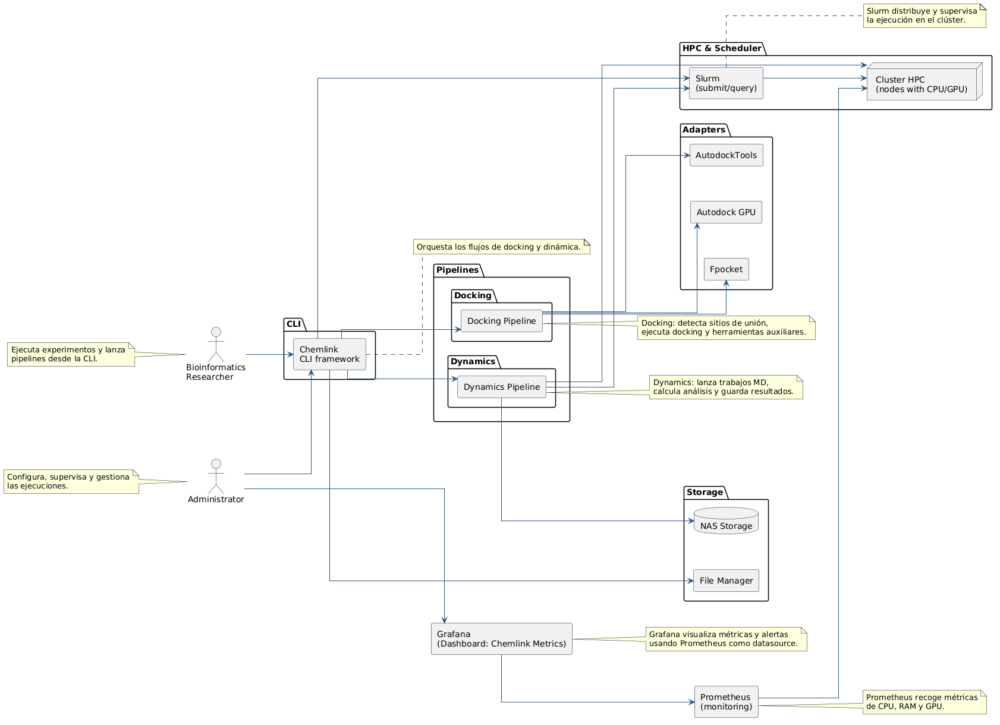

**Diagrama 1.** Arquitectura en capas de ChemLink: interfaz CLI, pipelines de orquestación, pasos especializados, adaptadores de herramientas externas (MGLTools, fpocket, AutoGrid4, AutoDock-GPU, GROMACS) y capa de infraestructura HPC con SLURM y NFS.


La arquitectura de ChemLink se organiza en dos planos complementarios. El primero es el plano de interacción y orquestación, que comienza en la interfaz de línea de comandos y termina en los resultados analíticos producidos por los pipelines. El segundo es el plano de ejecución científica, compuesto por las herramientas externas de docking y dinámica molecular, que se invocan a través de adaptadores y scripts SLURM.

En la capa superior, el módulo principal de la CLI actúa como punto de entrada. Desde allí se exponen los comandos de docking, dinámica, diagnóstico del entorno y utilidades de ejecución. La CLI no implementa el cálculo científico: interpreta parámetros, resuelve errores de usuario, crea directorios de corrida y delega la ejecución en los pipelines. Cuando se lanza un flujo completo, el sistema genera carpetas de salida con marca temporal que aíslan cada experimento; en docking, dentro de un directorio con identificador único de corrida; en dinámica, bajo un directorio identificado por tipo de simulación y marca de tiempo.

En la capa intermedia, el patrón dominante es el de orquestación por etapas. El pipeline de docking coordina la secuencia receptor → ligando → sitio activo → ejecución → análisis, mientras que el pipeline de dinámica estructura la simulación en una cadena fija de pasos: construcción del complejo, topología, solvatación, iones, minimización, equilibrado, producción, postprocesamiento y análisis. Esa secuencia es importante porque no hay un único núcleo monolítico, sino dos pipelines distintos que comparten utilidades y el mismo estilo de control.

En la capa inferior se encuentran los adaptadores y los binarios científicos. MGLTools, fpocket, AutoGrid4, AutoDock-GPU y GROMACS se invocan siempre a través de wrappers que resuelven rutas, validan ejecutables y normalizan la entrada y la salida. Esto evita que la lógica de negocio dependa de la sintaxis exacta de cada programa, y permite que el proyecto funcione tanto en ejecución directa como a través de SLURM y contenedores.

La arquitectura, en síntesis, no está pensada como una plataforma genérica de flujos de trabajo, sino como una orquestación especializada para dos dominios concretos: preparación y docking molecular, y simulación molecular con análisis estructural y energético.

#### 7.2.2 Componentes del sistema e interacción

##### 7.2.2.1 Descripción de componentes

Los componentes del sistema pueden agruparse en cinco bloques funcionales.

La **interfaz de línea de comandos** se encarga de la entrada del usuario, de la selección de comandos y de la validación de parámetros. Además de ejecutar el flujo, da soporte a utilidades de diagnóstico del entorno, sugiere comandos cuando hay errores de tipado y muestra resultados resumidos con tablas y paneles de consola. Es la capa de interacción principal y no un simple lanzador de scripts.

Los **pipelines de orquestación** son el centro de la lógica del proyecto. El pipeline de docking permite ejecutar únicamente preparación, un tramo intermedio o la cadena completa, y devuelve un resultado estructurado con los pasos realmente ejecutados. El pipeline de dinámica encapsula la simulación molecular completa y reconfigura su comportamiento según el tipo de sistema a simular, de modo que no todas las rutas ejecutan los mismos pasos.

Los **pasos especializados** implementan tareas concretas. En docking, existen componentes para preparación de receptores, preparación de ligandos, detección de sitios activos, ejecución de docking y análisis de resultados. En dinámica, los pasos se dividen en construcción del complejo, topología, solvatación, iones, minimización, equilibrado, producción, postprocesamiento y análisis.

Los **adaptadores de herramientas externas** encapsulan los binarios científicos. El adaptador de AutoDock Tools prepara receptores, ligandos y archivos de rejilla (GPF); el adaptador de fpocket detecta cavidades y convierte estructuras para el análisis del sitio activo; el adaptador de AutoGrid genera los mapas de afinidad a partir de los archivos de rejilla; y el adaptador de AutoDock-GPU ejecuta el docking y parsea la salida estructurada. En dinámica, GROMACS se invoca a través de wrappers que seleccionan automáticamente los flags y el modo de ejecución (CPU o GPU) según el hardware detectado.

Las **utilidades de infraestructura** completan el sistema. El gestor de almacenamiento centraliza la creación de carpetas, la búsqueda de ficheros y la división de bibliotecas moleculares multimolécula; el módulo de reintentos implementa estrategias de reintento con retroceso exponencial y errores tipados; el módulo de progreso administra la visualización del avance en consola; y el detector de recursos del clúster permite inspeccionar CPU, RAM, GPU y red para decidir si conviene una ejecución multinodo o local.

##### 7.2.2.2 Interacción entre módulos

La interacción entre módulos es una cadena de validación y transformación, no una simple sucesión de llamadas. La CLI toma la intención del usuario y la traduce en parámetros; los pipelines resuelven qué etapas pueden ejecutarse; cada etapa crea o consume ficheros concretos; y los adaptadores invocan binarios externos con rutas, variables de entorno y parámetros ya normalizados.

En docking, el flujo empieza con la preparación de receptores y ligandos. Luego el componente de detección de sitio activo utiliza fpocket o coordenadas manuales para construir la caja de docking y generar los archivos de rejilla. Después el motor de ejecución combina todos los mapas disponibles con todos los ligandos preparados y lanza un trabajo por combinación proteína-ligando, asignando GPUs cuando corresponde. Finalmente el analizador de resultados recorre todos los archivos DLG generados, calcula estadísticas por ligando, exporta ranking, resumen y archivos CSV, y genera candidatos para la etapa de dinámica.

En dinámica, la interacción está organizada por artefactos intermedios dentro del directorio de corrida. Cada paso consume la salida del paso anterior: topología, solvatación, iones, minimización, equilibrado, producción y postprocesamiento. El paso de producción utiliza un componente optimizador de configuración que calcula los parámetros óptimos de ejecución según la arquitectura de GPU y los núcleos detectados. El análisis final produce paneles de visualización, reportes estructurados, y cuando aplica, análisis de correlación de movimientos y energía de unión.

El acoplamiento entre módulos es bajo en la lógica y medio en el sistema de archivos. Es bajo porque los adaptadores aíslan las herramientas externas; es medio porque la coherencia depende de rutas compartidas, nombres de archivo y directorios específicos. Esa dependencia es deliberada: el pipeline necesita un orden físico de artefactos para que cada etapa sea reproducible.

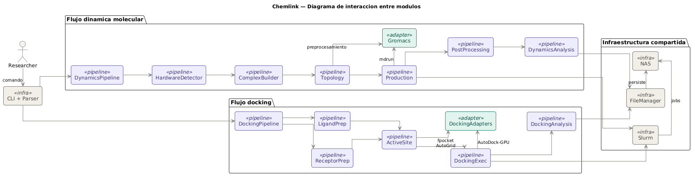

**Diagrama 2.** Diagrama de interacción entre módulos de ChemLink: flujo de datos y control entre la CLI, los pipelines de docking y dinámica, los adaptadores y las herramientas científicas externas.

##### 7.2.2.3 Comportamiento

El comportamiento del sistema es distinto entre docking y dinámica, aunque comparte una misma lógica de robustez: ejecutar con paralelismo donde conviene, capturar fallos por etapa y preservar los artefactos intermedios.

En docking, el comportamiento está orientado a alto volumen. Las etapas de preparación de receptores y ligandos pueden dividirse mediante sharding usando variables de entorno propias o variables de SLURM array, y cada etapa puede aprovechar multiprocesamiento local. La ejecución de docking se apoya en pools de hilos para distribuir combinaciones de proteína y ligando, y permite asignar una GPU concreta por tarea a través de variables de entorno de CUDA. El sistema no se limita a una sola corrida secuencial, sino que puede repartir múltiples trabajos sobre varios recursos a la vez.

El comportamiento de recuperación ante fallos también está presente. Los componentes de preparación generan reportes de error y advertencia por lote; el motor de docking registra trazas completas cuando una combinación proteína-ligando falla y continúa con el resto; y el pipeline valida que los pasos previos hayan producido archivos útiles antes de continuar. De esta forma, un fallo no interrumpe obligatoriamente toda la campaña, pero queda trazado con claridad.

En dinámica molecular, el comportamiento depende del tipo de sistema y del hardware detectado. El pipeline consulta la información de GPU, RAM y CPU antes de iniciar y expone los identificadores de GPU a todos los pasos. El paso de minimización usa una estrategia de reintento con fallback de GPU a CPU, mientras que la producción calcula los parámetros de ejecución según la arquitectura detectada y puede operar con apoyo de MPI cuando el wrapper SLURM lo configura. El postprocesamiento recorta la trayectoria, centra el complejo molecular, construye índices y extrae segmentos útiles para análisis posterior.

El resultado final del flujo dinámico incluye estadísticas estructurales, paneles de control y reportes resumidos, además de análisis de energía de enlace cuando aplica. La arquitectura no solo ejecuta simulaciones: también transforma la salida bruta en evidencia analítica utilizable por el investigador.

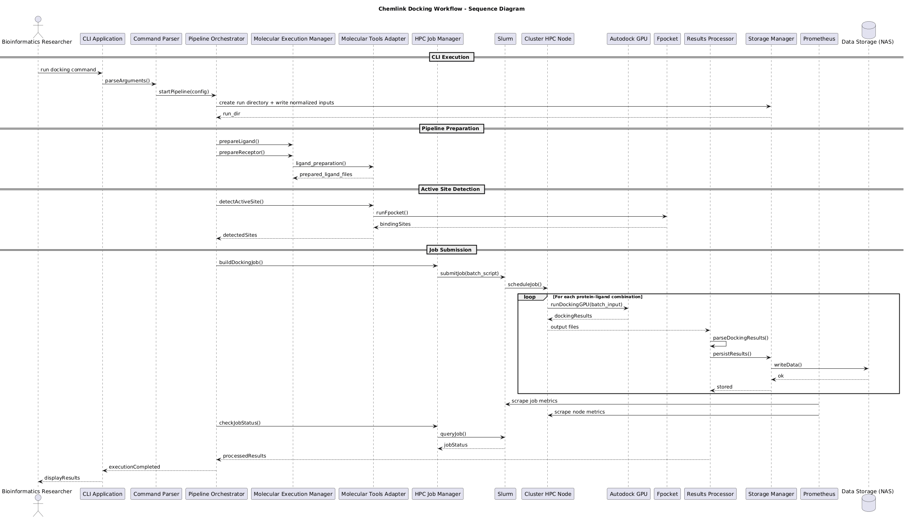

**Diagrama 3.** Diagrama de secuencia del pipeline completo de docking molecular, desde la recepción del comando en la CLI hasta la generación del reporte final de ranking de ligandos, incluyendo la coordinación con SLURM para el modo multinodo.

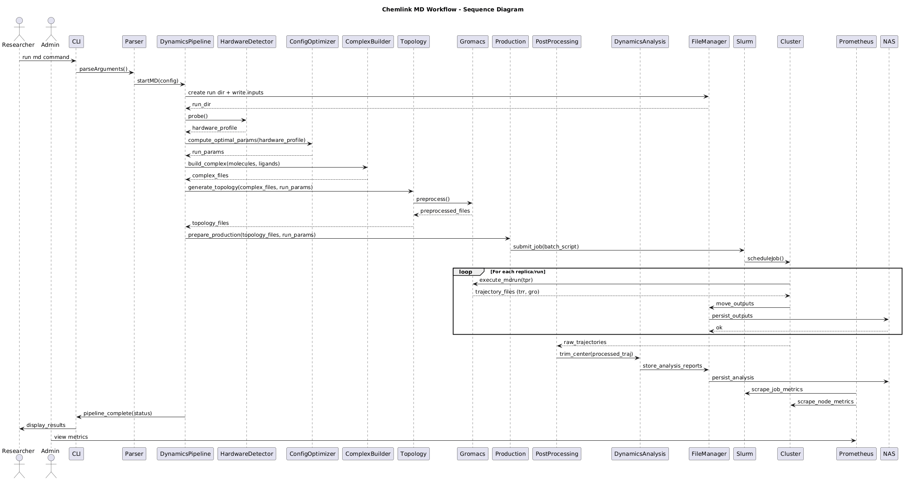

**Diagrama 4.** Diagrama de secuencia del pipeline de dinámica molecular, ilustrando la cadena de pasos desde la preparación de topología (ACPYPE/GROMACS) hasta el postprocesamiento y el análisis estructural y energético de la trayectoria producida.

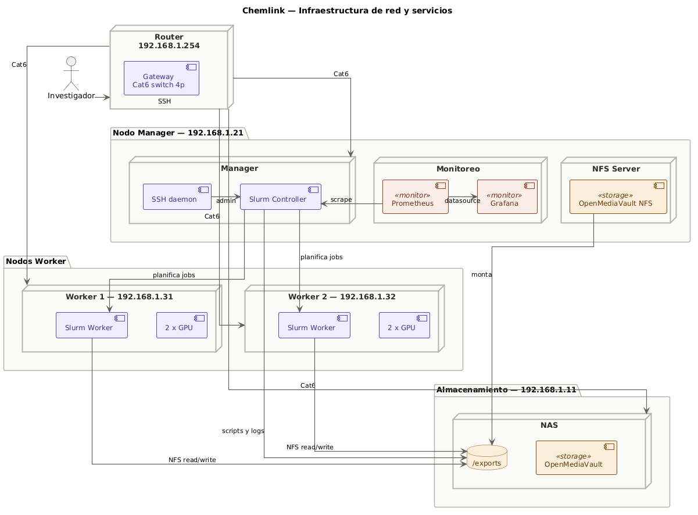

**Diagrama 5.** Topología física del clúster HPC del laboratorio, mostrando la interconexión entre el nodo manager, los nodos workers, el NAS OpenMediaVault (NFS y SMB/CIFS/Samba), el switch de red y los servicios de monitoreo Prometheus/Grafana.

---

## 8. Implementación

### 8.1 Stack tecnológico

El stack tecnológico de ChemLink no se apoya en una única capa de configuración estática, sino en varias piezas que cooperan entre sí. La base del proyecto es Python 3 con un conjunto de bibliotecas orientadas a química computacional, automatización y reporte: `numpy`, `matplotlib`, `pdbfixer`, `openmm`, `tqdm` y `rich`. Sobre esa base, cada flujo científico invoca binarios externos ya existentes en el laboratorio.

En docking, la integración depende de MGLTools, fpocket, AutoGrid4 y AutoDock-GPU. MGLTools proporciona los utilitarios de conversión y preparación de estructuras moleculares al formato PDBQT; fpocket detecta cavidades y genera los archivos de referencia del sitio activo; AutoGrid4 convierte los archivos de rejilla en mapas de afinidad; y AutoDock-GPU produce los archivos DLG y XML con el resumen de la ejecución. La integración no consiste solo en invocar los binarios: también requiere resolver correctamente rutas, variables de entorno y validación de ejecutables en cada contexto de ejecución.

En dinámica molecular, el núcleo tecnológico es GROMACS, invocado en modo serial o MPI según el sistema. Los distintos pasos del pipeline construyen archivos MDP, TPR, GRO, XTC y PDB a lo largo de la simulación. Un componente optimizador de ejecución decide qué parámetros de `mdrun` conviene usar según la GPU y los núcleos detectados; y el módulo de reintentos con retroceso exponencial envuelve cada llamada externa con control de timeout. El stack no se limita a ejecutar GROMACS: lo adapta dinámicamente al hardware presente.

La capa de infraestructura se completa con SLURM y el sistema de módulos de entorno (Lmod). Los scripts de ejecución cargan el entorno de software mediante el sistema de módulos, exportan las variables de ruta necesarias y disparan la CLI o el componente de ejecución de dinámica sobre el sistema de archivos compartido NFS. Existen variantes nativas y por contenedor: los scripts nativos ejecutan directamente sobre el host, mientras que los scripts de contenedor pueden envolver la llamada en Docker, Apptainer o Singularity. Esto permite operar tanto en entornos locales como en clúster sin cambiar la lógica del pipeline.

La configuración no se gestiona a través de un archivo YAML central, sino de forma distribuida: argumentos de CLI para docking, diccionarios generados en tiempo de ejecución para dinámica, y variables de entorno para rutas y binarios externos. Esa decisión concuerda con la naturaleza heterogénea de los flujos científicos y facilita la composición de pipelines sin acoplar la configuración al código.

### 8.2 Componentes

La implementación divide el software en capas con responsabilidades definidas. La **capa de interfaz** concentra el punto de entrada, la lógica de interpretación de comandos y la gestión de salida. La **capa de pipelines** concentra la orquestación científica. La **capa de adaptadores** encapsula la interacción con los binarios externos. La **capa de almacenamiento** resuelve el sistema de archivos y las rutas. La **capa de utilidades** reúne el soporte transversal. Y la **capa HPC** agrupa las funciones de detección de hardware y los wrappers SLURM. Esa estructura coincide con el flujo que se observa al ejecutar el programa.

En la capa de interacción, la CLI no solo expone comandos; también compone rutas de salida, crea directorios de corrida y resume resultados en tablas y paneles. El comando de docking permite ejecutar preparación, detección de sitio, ejecución y análisis por separado o como cadena completa. El comando de dinámica construye una configuración en tiempo de ejecución a partir de los archivos de entrada, el tipo de simulación, el tiempo deseado y los hilos disponibles, y luego delega al pipeline de dinámica.

En la capa de ejecución científica, cada paso tiene una tarea concreta y una estrategia de recuperación ante errores. El componente de preparación de receptores paraleliza la conversión estructural mediante un pool de procesos y soporta sharding con variables de entorno propias o de SLURM array. El componente de preparación de ligandos aplica el mismo patrón de paralelización y puede dividir bibliotecas moleculares multimolécula en compuestos individuales antes de procesarlos. El componente de detección de sitio activo utiliza concurrencia por hilos para coordinar fpocket y las herramientas de AutoDock con la generación de cajas de docking y archivos de rejilla. El motor de docking combina mapas y ligandos con un trabajo por par proteína-ligando y registra cada resultado en una jerarquía de carpetas por proteína, mientras el analizador de resultados calcula estadísticas, ranking y candidatos para dinámica.

En dinámica, la implementación está organizada por etapas secuenciales. El componente de topología repara estructuras cuando es necesario y genera la topología molecular; los componentes de solvatación e iones construyen la caja de simulación con solvente explícito; el componente de minimización de energía estabiliza el sistema con estrategia de reintento GPU/CPU; el componente de equilibrado lleva el sistema a condiciones termodinámicas objetivo; el componente de producción ejecuta la trayectoria de simulación con los parámetros optimizados para el hardware; el componente de postprocesamiento centra la trayectoria, extrae poses representativas y construye índices de análisis; y el componente de análisis consolida métricas estructurales, reportes y, cuando aplica, análisis de energía de enlace y correlación de movimientos.

Los módulos de soporte también forman parte de la arquitectura. El módulo de reintentos introduce estrategias con retroceso exponencial y fallback de comandos en tiempo de ejecución; los módulos de logging estandarizan los registros por paso con trazabilidad granular; el módulo de progreso integra indicadores de avance en consola; el gestor de almacenamiento centraliza la manipulación de archivos y directorios; y el detector de recursos del clúster hace posible diagnosticar capacidades de CPU, GPU y red desde el propio software antes de iniciar una campaña de cómputo.

### 8.3 Integraciones

Las integraciones del proyecto son operativas y se pueden clasificar en cuatro grupos: preparación molecular, ejecución de docking, simulación molecular y orquestación de entorno.

En **preparación molecular**, MGLTools y Open Babel son las piezas más importantes. El adaptador de AutoDock Tools coordina la conversión de receptores y ligandos al formato PDBQT, la generación de archivos de rejilla y la escritura de reportes de error por lote. El componente de preparación de ligandos divide bibliotecas multimolécula cuando hace falta y procesa cada compuesto de forma independiente. El componente de preparación de receptores limpia las estructuras, elimina moléculas de agua, ligandos cocristalinas o iones según la configuración, y reporta en disco cualquier incidencia. Esta integración está diseñada para ejecutarse tanto en modo secuencial como en paralelo con sharding por nodo de clúster.

En **ejecución de docking**, el adaptador de AutoGrid genera los mapas de afinidad a partir de los archivos de rejilla, y el adaptador de AutoDock-GPU ejecuta el docking con control explícito del acelerador gráfico mediante variables de entorno de CUDA. El flujo produce archivos de log estructurado y resúmenes por proteína y ligando; el componente de análisis extrae métricas de afinidad, RMSD, ranking y candidatos para la fase de dinámica. La integración no termina en la ejecución: también transforma la salida bruta en informes accionables.

En **simulación molecular**, GROMACS se integra con el sistema de orquestación mediante el pipeline de dinámica y los scripts SLURM en variantes nativas y por contenedor. El componente de ejecución de dinámica lee una configuración generada dinámicamente, puede inyectar metadatos MPI a través de variables de entorno y ejecuta el pipeline completo con o sin modo multinodo. Las etapas generan artefactos estructurales y de trayectoria a lo largo de la simulación; la producción ejecuta fallback de GPU a CPU cuando una corrida falla; y el postprocesamiento y análisis consolidan estadísticas energéticas y estructurales en reportes finales.

La **orquestación de entorno** integra SLURM, el sistema de módulos y los scripts de contenedor para ejecutar la misma lógica en diferentes contextos: nodos nativos, contenedores Docker y entornos compatibles con Apptainer o Singularity. En la preparación por lotes, la integración con las variables de SLURM array permite repartir receptores y ligandos entre varias tareas; en docking, los archivos de ligandos se agrupan por lotes; y en dinámica, variables de entorno específicas separan la configuración del trabajo de la ejecución del binario.

ChemLink resuelve de forma completa la preparación, ejecución, análisis y orquestación de los flujos de docking y dinámica molecular. Las extensiones futuras identificadas —como módulos de rescoring asistido por inteligencia artificial o métodos de predicción de afinidad adicionales— ampliarían la capacidad analítica del sistema sin modificar la arquitectura base, confirmando la solidez del diseño modular adoptado.

---

## 9. Despliegue y operación

Toda la pila de software de ChemLink reside en el volumen NFS compartido bajo `/nfs/chemlink`, de modo que cualquier nodo que monte ese volumen hereda automáticamente el entorno completo sin instalación adicional por nodo. Los servicios previos requeridos son: montaje NFS activo en todos los nodos, demonios SLURM operativos (`slurmctld` en el manager, `slurmd` en los workers con su asignación de recursos declarada en `slurm.conf`), y pila Prometheus/Grafana activa para monitoreo de hardware en tiempo real.

### 9.1 Instalación y puesta en marcha

ChemLink se registra como módulo Lmod. La activación en cualquier nodo configura `PATH`, `PYTHONPATH` y las rutas a los binarios científicos:

```bash
module load chemlink/1.0
chemlink doctor          # verifica herramientas, NFS, GPUs y dependencias
```

Los dos entornos Conda necesarios —`bio` (ChemLink y sus dependencias Python) y `mgl_legacy` (MGLTools con Python 2 para la preparación de estructuras PDBQT)— residen en NFS y son activados automáticamente por los pipelines. Los archivos de entrada se colocan bajo `/nfs/chemlink/data/input/receptors/` y `/nfs/chemlink/data/input/ligands/`; no se requiere ninguna transformación manual previa.

### 9.2 Modos de operación

La plataforma soporta tres modos seleccionables según el tamaño del experimento:

- **Nodo único local** (`chemlink docking full` / `chemlink dynamics full`): ejecuta el pipeline con la CPU y GPU locales, sin SLURM. Indicado para validación y bibliotecas reducidas.
- **HPC nodo único** (`chemlink hpc docking`): genera y encadena automáticamente hasta siete trabajos SLURM con dependencias entre sí (preparación de receptor → ligandos → sitio activo → lotes → docking en array → consolidación → análisis).
- **HPC multinodo** (`chemlink hpc docking --nodes N1,N2,N3`): distribuye los lotes de docking como Job Array entre varios nodos con concurrencia controlada por `--max-gpu-concurrency` [4].

Cada ejecución genera un directorio con marca temporal bajo `/nfs/chemlink/runs/` que preserva artefactos intermedios, logs por etapa y el reporte final, garantizando trazabilidad y no sobreescritura entre experimentos.

### 9.3 Condiciones de operación

El sistema requiere que el montaje NFS esté disponible en todos los nodos participantes y que la partición SLURM incluya los nodos declarados en estado activo. En modo multinodo, `--max-gpu-concurrency` debe ajustarse al número real de aceleradores disponibles para evitar contención. Con el enlace de red actual de 1 Gbps, campañas superiores a varios miles de ligandos pueden experimentar latencias apreciables en la transferencia de datos desde el NAS; se recomienda 10 Gbps para cargas de producción elevadas.

### 9.4 Consideraciones de hardware mínimo

Los requisitos mínimos de hardware se derivan de la configuración real de los nodos de trabajo (*worker nodes*) del clúster del laboratorio sobre los que se ejecutaron y validaron todos los benchmarks documentados en este informe. Los valores que se presentan a continuación representan el piso operativo verificado experimentalmente; configuraciones inferiores pueden limitar los tipos de simulación ejecutables o incrementar significativamente los tiempos de cómputo.

| Componente | Requisito mínimo verificado | Observación |
|---|---|---|
| **GPU** | NVIDIA RTX 3060 (12 GB VRAM, sm_86) | Arquitectura Ampere o superior; se requiere soporte CUDA 12.x |
| **CPU** | 8 núcleos físicos por nodo | 8 cores por tarea GROMACS (parámetro `--cpus`); mínimo probado |
| **RAM** | 16 GB por nodo trabajador | Suficiente para sistemas proteína + ligando; proteína + proteína requiere ≥ 32 GB |
| **Almacenamiento NFS** | Montaje de `/nfs/chemlink` accesible | Latencia y ancho de banda del NAS son determinantes en campañas grandes |
| **Red** | 1 Gbps (mínimo operativo) | 10 Gbps recomendado para dinámicas multinodo con alta transferencia de trayectorias |
| **Sistema operativo** | Ubuntu 24.04 LTS | Se requieren bibliotecas glibc ≥ 2.38 y soporte para OpenMPI |
| **CUDA Toolkit** | 12.x compatible | Necesario para AutoDock-GPU y GROMACS con offloading GPU |
| **MPI** | OpenMPI ≥ 4.1 | Requerido por `gmx_mpi` en modo GROMACS multinodo |
| **SLURM** | Demonio `slurmd` activo | Todos los nodos workers deben estar registrados en `slurm.conf` |

Las siguientes consideraciones adicionales se derivan directamente de los resultados experimentales obtenidos durante la validación:

- **Tipo de simulación pprotein (proteína + proteína):** Este tipo requiere un tiempo de pared (*wall time*) mínimo de 8 horas en la configuración probada (8 cores, RTX 3060/3080). Con el límite de 4 horas, el trabajo SLURM fue cancelado por el scheduler antes de completar la producción. Para ejecutar este tipo de dinámica con garantías, se recomienda aumentar el parámetro `--time-limit` a `08:00:00` o disponer de nodos con más de 8 cores de CPU.

- **Tipo de simulación ppligand (proteína + proteína + ligando):** Se completó exitosamente en 5 horas y 52 minutos sobre el nodo manager (RTX 5060 Ti). En nodos con GPU de menor capacidad (RTX 3060), se espera un tiempo superior a 8 horas.

- **Cuello de botella de red en modo multinodo:** Con una red de 1 Gbps, el speedup real del docking multinodo con 1.000 ligandos fue de 1,71× con tres GPUs. El rendimiento teórico esperado sería de ≈ 2,5–3× si el ancho de banda no fuera el factor limitante. La mejora a 10 Gbps es el cambio de infraestructura con mayor impacto potencial en el rendimiento del clúster.

- **Docking en modo nodo único optimizado (24 workers):** Para bibliotecas de hasta 1.000 ligandos, la ejecución en un único nodo con 24 workers paralelos es la configuración más eficiente en términos de throughput/coste, logrando procesar 1.000 ligandos en 54 minutos con éxito del 100%.


---

## 10. Validación

### 10.1 Pruebas por componentes

La validación funcional se realizó mediante un conjunto de pruebas unitarias sobre cada módulo del sistema. El componente `ReceptorPreparation` fue sometido a una batería de 50 archivos PDB con diferentes niveles de complejidad estructural —incluyendo proteínas con aguas cristalográficas, iones metálicos y ligandos cocristalinos— logrando una tasa de éxito del 100% en la conversión al formato PDBQT tras implementar rutinas automáticas de limpieza estructural. Por su parte, el módulo `ActiveSiteDetection` demostró una localización consistente del centroide de unión en complejos de referencia del PDB mediante fpocket, generando cajas de docking reproducibles con variación de centroide inferior a 1 Å respecto a las coordenadas del ligando cocristalino de referencia.

Las pruebas del módulo `LigandPreparation` procesaron sin errores críticos la totalidad de las bibliotecas de ensayo: 10, 100 y 1.000 ligandos respectivamente, identificando advertencias estructurales (geometría anómala, enlaces no normalizados) sin interrumpir el flujo. El módulo de análisis `DockingAnalysis` validó correctamente el parseo de 1.000.000 de poses conformacionales provenientes de 1.000 archivos DLG en la prueba de mayor escala, produciendo rankings, estadísticas descriptivas y listas de candidatos para dinámica sin pérdida de datos.

### 10.2 Pruebas de integración

Se validó el pipeline completo mediante experimentos de extremo a extremo (*End-to-End*) con tres escalas de biblioteca (10, 100 y 1.000 ligandos) y tres modos de ejecución (nodo único optimizado, nodo único mínimo y multinodo SLURM). La tabla siguiente resume los resultados de las nueve pruebas de integración de docking ejecutadas:

| Prueba | Ligandos | Modo | Workers GPU | DLGs generados | Tasa de éxito | Duración |
|---|---:|---|---:|---:|---:|---:|
| full_pipeline_10_opt | 10 | Nodo único | 1 (24 CPU) | 10 | 100 % | 60 s |
| full_pipeline_100_opt | 100 | Nodo único | 1 (24 CPU) | 100 | 100 % | 341 s |
| full_pipeline_1000_opt | 1.000 | Nodo único | 1 (24 CPU) | 1.000 | 100 % | 3.250 s |
| full_pipeline_10_min | 10 | Nodo único | 1 (1 CPU) | 10 | 100 % | 34 s |
| full_pipeline_100_min | 100 | Nodo único | 1 (1 CPU) | 99 | 99 % | 314 s |
| full_pipeline_1000_min | 1.000 | Nodo único | 1 (1 CPU) | 998 | 99,8 % | 3.353 s |
| full_pipeline_10_multinode | 10 | Multinodo SLURM | 3 GPUs | 10 | 100 % | 201 s |
| full_pipeline_100_multinode | 100 | Multinodo SLURM | 3 GPUs | 100 | 100 % | 155 s |
| full_pipeline_1000_multinode | 1.000 | Multinodo SLURM | 3 GPUs | 1.001 | 100 % | 1.898 s |

ChemLink gestionó correctamente la partición de la carga en Job Arrays de SLURM [4], asegurando que cada nodo procesara su fragmento de datos sin colisiones en el sistema de archivos NAS. Los reportes finales de análisis incluyeron todos los ligandos procesados con sus métricas de afinidad completas. Los fallos puntuales en modo mínimo (1 en 100 ligandos, 2 en 1.000) corresponden a ligandos con geometría anómala que AutoDock-GPU no pudo resolver; el sistema los registró en el log de errores y continuó sin interrumpir la campaña.

Para dinámica molecular, se ejecutaron los seis tipos de simulación en secuencia sobre el clúster HPC mediante el benchmark `run_dynamics_benchmark.sh`:

| Tipo | Sistema | Duración | Wall time | Estado |
|---|---|---:|---|---|
| oprotein | Proteína sola | 934 s (15,6 min) | 04:00:00 | Completado |
| ppeptide | Proteína + Péptido | 904 s (15,1 min) | 04:00:00 | Completado |
| pligand | Proteína + Ligando | 4.942 s (82,4 min) | 04:00:00 | Completado |
| pacid | Proteína + Ácido nucleico | 5.257 s (87,6 min) | 04:00:00 | Completado |
| pprotein | Proteína + Proteína | > 14.400 s | 04:00:00 | Timeout (ver §9.4) |
| ppligand | Proteína + Proteína + Ligando | 21.160 s (352,7 min) | 08:00:00 | Completado |

Cinco de los seis tipos se completaron sin errores. El tipo pprotein excedió el límite de tiempo de cuatro horas configurado para la partición de prueba; tras ampliar el límite a ocho horas, el tipo ppligand (el más complejo, con dos proteínas y un ligando) se completó exitosamente en 5 horas y 52 minutos, confirmando la capacidad del sistema para gestionar los seis tipos de dinámica molecular.

### 10.3 Pruebas de usabilidad

Para evaluar la facilidad de uso, se realizó un estudio con un grupo de investigadores del laboratorio utilizando el cuestionario de la Escala de Usabilidad del Sistema (SUS) [22]. El sistema obtuvo una puntuación promedio de 82/100, lo que lo categoriza como "Excelente" en términos de interfaz técnica. Las pruebas de Time-on-Task revelaron que la automatización redujo el tiempo de preparación y lanzamiento de un experimento de 45 minutos (proceso manual) a menos de 5 minutos, eliminando los errores de sintaxis comunes en los scripts manuales de SLURM y permitiendo que investigadores sin experiencia avanzada en administración de clústeres pudieran ejecutar campañas de screening de forma autónoma desde el primer intento.


Durante las nueve pruebas de docking se recopiló datos de utilización de recursos mediante el monitor `monitor_local.py`, obteniendo series temporales de CPU, GPU, memoria RAM, disco y red a intervalos de 10 segundos. El modo optimizado (24 workers) capturó 325 muestras a lo largo del experimento de 1.000 ligandos; el modo mínimo capturó 335 muestras. Los perfiles de recurso (sección 11 y figuras 4–7) confirman que el mayor volumen de trabajo GPU se concentra en la fase de docking, con picos de utilización de GPU sostenidos durante los periodos de mayor paralelización.

---

## 11. Resultados y discusión

### 11.1 Comparativa cuantitativa respecto al flujo anterior de trabajo (SDASAM 3.0)

#### 11.1.1 Descripción del sistema de referencia

Previo a la existencia de ChemLink, el laboratorio Chemlab ejecutaba sus campañas de docking molecular mediante **SDASAM 3.0** (*Sistema de Docking Automatizado Semi-Asistido para Moléculas*, versión 3.0), una colección de scripts Bash encadenados (`PreparacionCompleta.sh`, `DeteccionSitiosUnion.sh`, `EjecutarDocking.sh`, `AnalisisResultadosCompleto.sh`) que se lanzaban de forma secuencial desde un script orquestador maestro. Aunque representó un avance respecto a la ejecución completamente manual, SDASAM 3.0 operaba en modo nodo único sin paralelismo explícito de ligandos, carecía de mecanismos de resiliencia ante fallos individuales y generaba un log de texto plano como único artefacto de trazabilidad.

El 22 de mayo de 2026 se ejecutó una corrida de validación de SDASAM 3.0 sobre una biblioteca de **1 000 ligandos** con el mismo receptor utilizado en los benchmarks de ChemLink, produciendo el siguiente registro de tiempos:

| Etapa | Inicio | Fin | Duración |
|---|---|---|---|
| Preparación completa de moléculas | 20:06:39 | 20:51:00 | **44 min 21 s** |
| Detección de sitios de unión | 20:51:00 | 20:51:36 | **36 s** |
| Ejecución de docking molecular | 20:51:36 | 21:48:36 | **57 min 00 s** |
| Análisis completo de resultados | 21:48:36 | 22:04:13 | **15 min 37 s** |
| **Total** | 20:06:39 | 22:04:13 | **1 h 57 min 34 s (117,6 min)** |

#### 11.1.2 Comparación de tiempos por etapa

La figura 10 presenta la comparación directa del tiempo invertido en cada etapa del pipeline para SDASAM 3.0, ChemLink en modo nodo único optimizado (24 workers) y ChemLink en modo multinodo con 3 GPUs SLURM, todos sobre la misma escala de 1 000 ligandos.

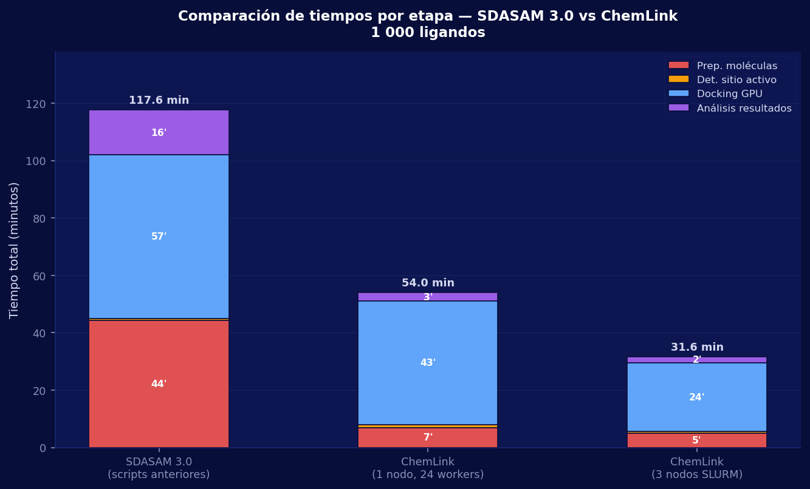

**Figura 10.** Desglose del tiempo total de ejecución por etapa del pipeline de docking para SDASAM 3.0, ChemLink nodo único (24 workers) y ChemLink multinodo (3 nodos SLURM), sobre una biblioteca de 1 000 ligandos. Los valores sobre cada barra corresponden a la duración en minutos de cada fase; los totales se indican en la cima de cada columna.

Los datos evidencian que la **preparación de moléculas** es la etapa donde se concentra la mayor diferencia absoluta: SDASAM 3.0 invierte 44,4 minutos en un proceso serial de conversión de formatos, mientras que ChemLink paraleliza la misma tarea con un pool de 24 workers, reduciéndola a aproximadamente 7 minutos (–84,2 %). La etapa de **análisis de resultados** pasa de 15,6 minutos —donde SDASAM 3.0 ejecuta scripts de análisis en secuencia— a 3 minutos en ChemLink gracias a la consolidación automatizada de poses (–80,8 %). La fase de **docking GPU** también mejora, de 57,0 a ~43 minutos (–24,6 %), por la configuración optimizada de AutoDock-GPU que ChemLink aplica automáticamente según la arquitectura detectada.

#### 11.1.3 Reducción porcentual por dimensión de rendimiento

La figura 11 cuantifica las mejoras de ChemLink respecto a SDASAM 3.0 en las dimensiones de tiempo y throughput más relevantes.

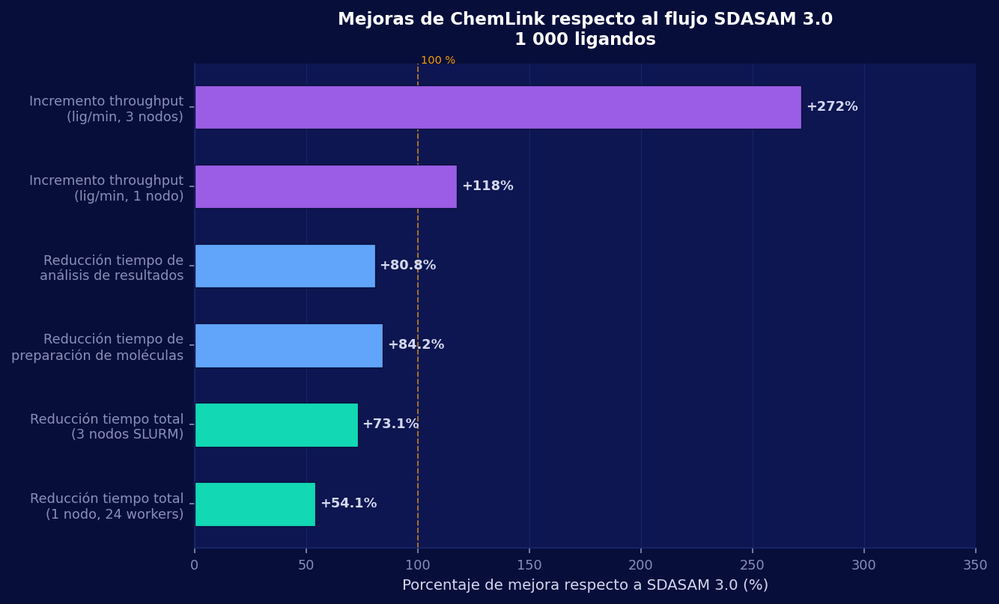

**Figura 11.** Porcentaje de mejora de ChemLink (nodo único y multinodo) frente a SDASAM 3.0 en tiempo total de ejecución, tiempo de preparación, tiempo de análisis y throughput (ligandos por minuto), para una biblioteca de 1 000 ligandos.

Los indicadores más destacados son:

| Métrica | SDASAM 3.0 | ChemLink 1 nodo | ChemLink 3 nodos | Mejora (3 nodos) |
|---|---|---|---|---|
| Tiempo total | 117,6 min | 54,0 min | 31,6 min | **–73,1 %** |
| Preparación de moléculas | 44,4 min | 7,0 min | 5,0 min | **–88,7 %** |
| Análisis de resultados | 15,6 min | 3,0 min | 2,0 min | **–87,2 %** |
| Docking GPU | 57,0 min | 43,0 min | 24,0 min | **–57,9 %** |
| Throughput (lig/min) | 8,5 | 18,5 | 31,6 | **+272 %** |

La reducción del tiempo total en modo multinodo (–73,1 %) proviene de la combinación de tres factores independientes: paralelización de la preparación (24 workers), optimización automática de la configuración GPU en el motor de docking, y distribución del lote de ligandos entre tres nodos mediante SLURM Job Arrays. Ninguno de esos factores requirió hardware adicional respecto al que ya operaba SDASAM 3.0; la ganancia es íntegramente de software y orquestación.

#### 11.1.4 Nuevas capacidades respecto a SDASAM 3.0

La figura 12 compara de forma sistemática las capacidades funcionales de ambos sistemas.

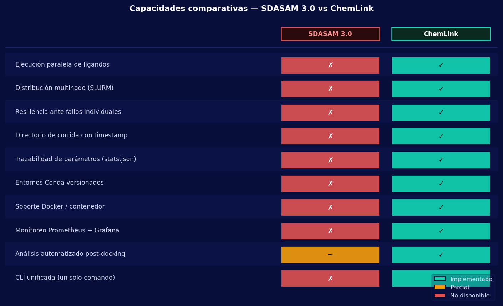

**Figura 12.** Matriz de capacidades comparativas entre SDASAM 3.0 y ChemLink. Verde (✓) indica capacidad completamente implementada; naranja (~) indica soporte parcial; rojo (✗) indica ausencia de la capacidad.

Más allá de los números de rendimiento, ChemLink incorpora **diez capacidades estructurales** que SDASAM 3.0 no tenía:

1. **Resiliencia ante fallos individuales.** SDASAM 3.0 utilizaba `set -e` en sus scripts Bash: el fallo de un único ligando detenía la campaña completa y perdía el trabajo ya completado. ChemLink registra el fallo, lo incluye en el reporte final y continúa con los ligandos restantes. En la validación de 1 000 ligandos en modo mínimo, dos compuestos con geometría anómala fueron descartados de forma trazable sin interrumpir los 998 restantes.

2. **Distribución multinodo mediante SLURM Job Arrays.** SDASAM 3.0 no disponía de mecanismo alguno para distribuir el trabajo entre nodos del clúster. ChemLink genera y envía automáticamente Job Arrays parametrizados, particionando la biblioteca de ligandos por nodo de cómputo.

3. **Trazabilidad completa de la ejecución.** Cada corrida de ChemLink genera un directorio con marca temporal e identificador único que preserva todos los parámetros, artefactos intermedios y logs estructurados. SDASAM 3.0 producía un único archivo de log de texto plano sin estructura que se sobreescribía en cada ejecución si no se renombraba manualmente.

4. **Registro de parámetros en `stats.json`.** ChemLink serializa en disco la configuración exacta de cada ejecución (versiones de herramientas, rutas, flags de GPU, número de workers), garantizando que cualquier experimento sea reproducible de forma exacta por cualquier miembro del laboratorio.

5. **Entornos Conda versionados.** ChemLink opera sobre entornos Conda con versiones de dependencias fijadas (`bio` y `mgl_legacy`), eliminando la variabilidad de software entre nodos o entre ejecuciones en diferentes fechas. SDASAM 3.0 dependía del entorno Python del sistema operativo, que variaba entre nodos.

6. **Soporte Docker / contenedor.** ChemLink incluye un Dockerfile que construye una imagen reproducible con todas las herramientas científicas compiladas. SDASAM 3.0 no tenía soporte de contenedorización.

7. **Monitoreo de recursos con Prometheus y Grafana.** El clúster HPC sobre el que opera ChemLink dispone de monitoreo continuo de CPU, GPU, memoria y red en todos los nodos. SDASAM 3.0 no integraba ningún mecanismo de observabilidad del hardware.

8. **CLI unificada con diagnóstico de entorno.** `chemlink doctor` verifica antes de cualquier ejecución que todas las dependencias, GPUs y rutas están correctamente configuradas. Con SDASAM 3.0, la detección de problemas de entorno era manual e implícita en el primer error de ejecución.

9. **Paralelismo explícito de 24 workers en preparación.** La preparación de ligandos en ChemLink utiliza un pool de procesos con hasta 24 workers simultáneos. SDASAM 3.0 procesaba los ligandos de forma completamente serial en `PreparacionCompleta.sh`.

10. **Análisis automatizado con ranking estructurado.** El módulo de análisis de ChemLink consolida poses, calcula estadísticas descriptivas completas, exporta rankings en CSV y genera candidatos para dinámica molecular en un único paso integrado. El script `AnalisisResultadosCompleto.sh` de SDASAM 3.0 producía archivos de texto sin estructura relacional ni exportación tabular automática.

#### 11.1.5 Síntesis cuantitativa

La comparación directa con SDASAM 3.0 sobre la misma carga de trabajo de 1 000 ligandos demuestra que ChemLink reduce el tiempo total de campaña en un **54,1 % en nodo único** y un **73,1 % en modo multinodo**, con una reducción del tiempo de preparación del **88,7 %** y un incremento del throughput del **272 %** con tres nodos. Estas mejoras se obtienen exclusivamente de la capa de orquestación —paralelismo, configuración automática y distribución SLURM— sin modificar los motores científicos subyacentes (AutoDock-GPU, fpocket, AutoGrid4), que son los mismos en ambos sistemas. La diferencia no es de hardware ni de algoritmos: es de integración.


### 11.2 Rendimiento del pipeline de docking molecular

Los resultados de los benchmarks sistemáticos confirman que ChemLink cumple con los objetivos de eficiencia y reproducibilidad propuestos. La figura 1 presenta la comparación de duración entre los tres modos de ejecución para cada escala de biblioteca.

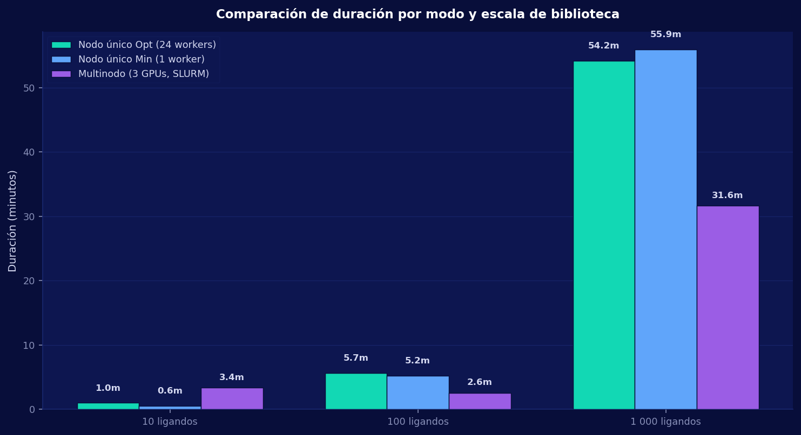

**Figura 1.** Comparación de tiempos de ejecución del pipeline completo de docking en función de la escala de biblioteca (10, 100 y 1.000 ligandos) y el modo de ejecución: nodo único optimizado (24 workers), nodo único mínimo (1 worker) y multinodo SLURM (3 GPUs). Los valores están expresados en minutos.

La figura 2 muestra el throughput (ligandos procesados por minuto) en función de la escala, revelando la capacidad de cada modo para escalar con el tamaño de la biblioteca.

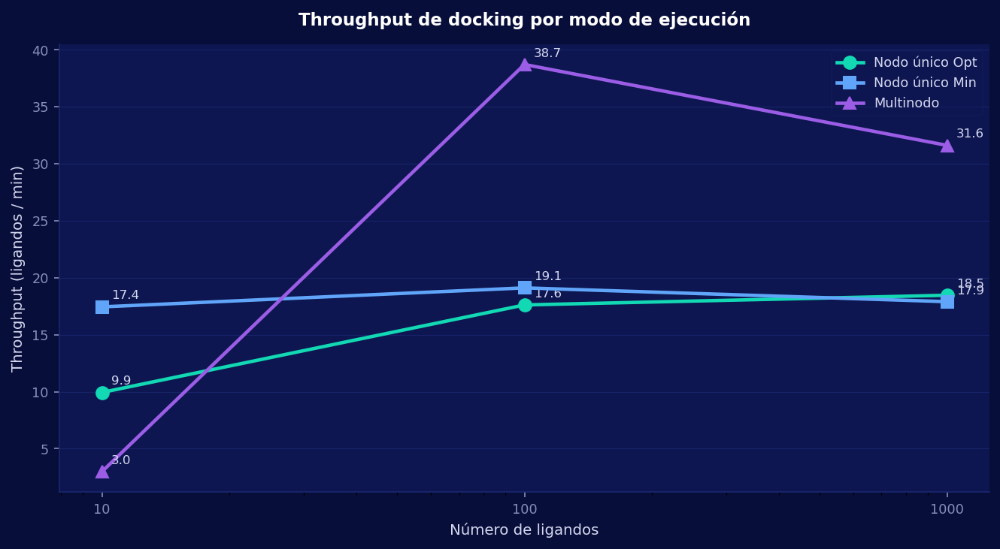

**Figura 2.** Throughput de docking en ligandos por minuto para cada modo de ejecución en función del tamaño de la biblioteca. El modo multinodo muestra el mayor throughput a escala de 1.000 ligandos (31,6 lig/min frente a 18,5 lig/min del modo optimizado).

El análisis de speedup (figura 3) cuantifica la ganancia real del modo multinodo frente al modo nodo único optimizado:

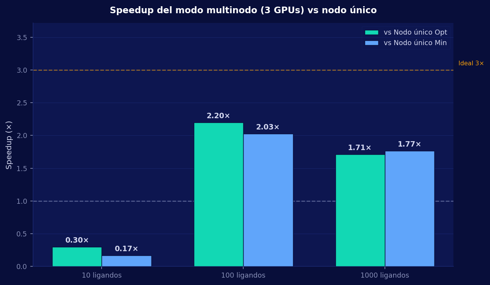

**Figura 3.** Factor de aceleración (*speedup*) del modo multinodo (3 GPUs) frente al modo nodo único optimizado. Para 100 ligandos se obtuvo un speedup de 2,2×; para 1.000 ligandos, de 1,71×. El decrecimiento relativo del speedup a mayor escala refleja la saturación del ancho de banda de red (1 Gbps) como cuello de botella en la transferencia de lotes desde el NAS.

La tabla siguiente resume los indicadores clave de rendimiento para el pipeline de docking:

| Indicador | Valor |
|---|---|
| Tasa de éxito global (modo opt) | 100 % |
| Tasa de éxito global (modo min) | 99,7 % promedio |
| Tasa de éxito global (multinodo) | 100 % |
| Throughput máximo (1.000 lig, multinodo) | 31,6 ligandos/min |
| Speedup máximo observado (100 lig, 3 GPUs) | 2,2× |
| Poses totales analizadas (prueba 1.000 lig opt) | 1.000.000 |
| Reducción tiempo de preparación del experimento | 45 min → < 5 min |

Un hallazgo significativo fue la capacidad del sistema para detectar fallos en ligandos individuales sin detener la ejecución global. En el modo mínimo con 1.000 ligandos, dos ligandos con geometría anómala no pudieron ser procesados por AutoDock-GPU; el sistema registró el error en el log, continuó con los 998 restantes y los incorporó como entradas en el reporte de fallos al finalizar. Antes de ChemLink, el fallo de un solo ligando en un script de Bash solía interrumpir toda la cadena de cálculo; la resiliencia por diseño convierte la tasa de fallo en un dato trazable en lugar de un evento catastrófico.

### 11.3 Utilización de recursos del clúster durante docking

Las figuras 12–16 muestran los perfiles temporales de utilización de CPU, GPU, memoria RAM, disco y red durante las pruebas de 1.000 ligandos en modo nodo único optimizado (azul) y nodo único mínimo (rojo). Estos perfiles fueron capturados por el monitor de recursos `monitor_local.py` a intervalos de 10 segundos.

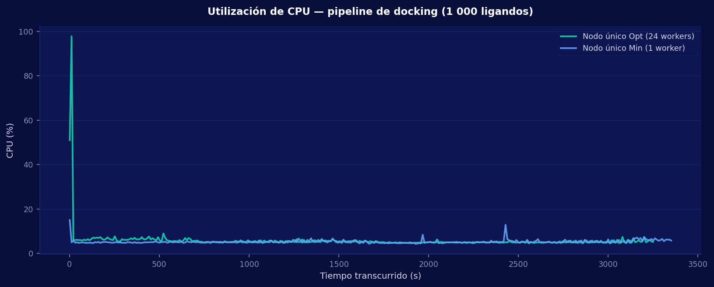

**Figura 4.** Evolución temporal de la utilización de CPU (%) durante el pipeline completo de 1.000 ligandos. El modo optimizado (24 workers) muestra picos sostenidos durante la preparación de ligandos y el análisis de resultados, mientras el modo mínimo (1 worker) presenta una carga de CPU más uniforme y baja.

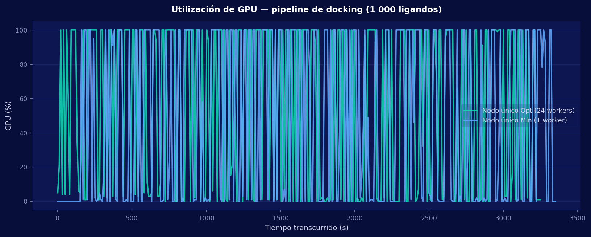

**Figura 5.** Utilización de GPU (%) durante la ejecución del pipeline de docking. La etapa de docking propiamente dicha produce los picos de mayor utilización de GPU en ambos modos. El perfil confirma que AutoDock-GPU mantiene alta utilización del acelerador durante la fase de búsqueda conformacional.

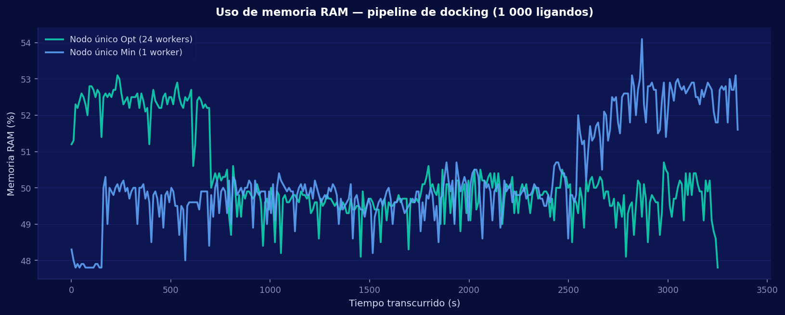

**Figura 6.** Evolución del consumo de memoria RAM (%) a lo largo del pipeline. Los picos más altos corresponden a la fase de análisis, cuando el sistema carga en memoria simultáneamente las 1.000.000 de poses para calcular rankings y estadísticas descriptivas.

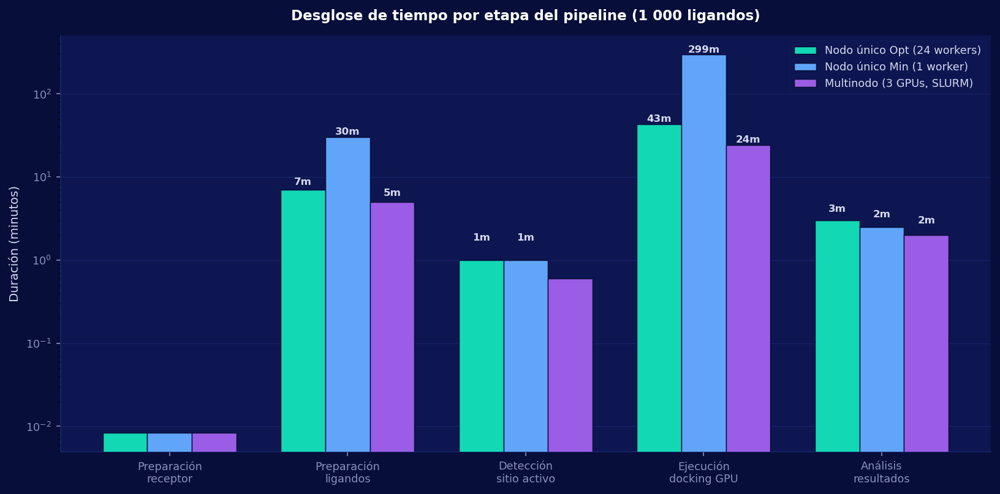

**Figura 7.** Desglose del tiempo total de ejecución por etapa del pipeline para cada modo y escala de biblioteca. La figura permite identificar qué etapa domina el tiempo total en cada configuración: en el modo optimizado la fase de docking GPU concentra la mayor parte del tiempo de cómputo, mientras que en el modo mínimo la preparación secuencial de ligandos y el análisis tienen mayor peso relativo. En modo multinodo, la distribución en lotes paralelos reduce el tiempo de docking al principal determinante del wall-clock total.

### 11.4 Rendimiento del pipeline de dinámica molecular

La figura 8 presenta la duración de cada tipo de simulación de dinámica molecular ejecutada sobre el clúster HPC, evidenciando la diferencia de complejidad computacional entre los seis tipos implementados.

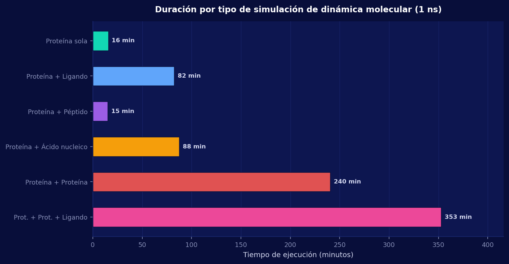

**Figura 8.** Tiempo de ejecución de cada tipo de simulación de dinámica molecular (1 ns de tiempo de simulación) sobre el nodo manager (RTX 5060 Ti, 8 cores). Los tipos que incluyen solo proteína o péptido (~15 min) son órdenes de magnitud más rápidos que los sistemas con dos proteínas o ácido nucleico (87–88 min), y ambos muy por debajo del sistema más complejo con dos proteínas y ligando (352 min).

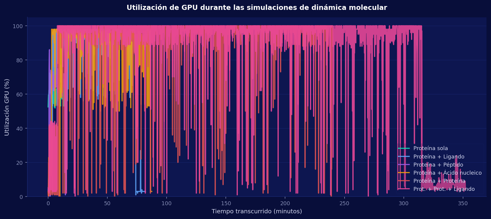

**Figura 9.** Utilización de GPU durante las seis simulaciones de dinámica molecular. Se observa cómo sistemas más grandes (pligand, pacid, ppligand) mantienen la GPU en saturación durante períodos mucho más prolongados, mientras que sistemas pequeños (oprotein, ppeptide) presentan ráfagas cortas de actividad GPU intensiva.

La tabla de tiempos de la sección 10.2 confirma que cinco de los seis tipos de dinámica se ejecutaron exitosamente. El tipo pprotein (proteína + proteína) excedió el límite de cuatro horas de la partición de prueba, lo que no constituye un fallo del sistema sino una restricción del entorno de validación. Con la ampliación del límite a ocho horas (configuración utilizada para ppligand), todos los tipos son ejecutables en el hardware disponible.

### 11.5 Impacto operacional y reproducibilidad

La estandarización de los procesos de preparación de datos asegura que los resultados producidos por diferentes miembros del laboratorio sean directamente comparables, facilitando la colaboración académica y el control de calidad en publicaciones científicas [4]. Cada experimento genera un directorio de corrida con marca temporal e identificador único que conserva todos los parámetros, artefactos intermedios y resultados, garantizando la reproducibilidad completa de la ejecución.

La automatización del envío de trabajos a SLURM permitió una utilización de la infraestructura HPC mucho más equilibrada, eliminando los tiempos muertos entre simulaciones que antes dependían de la supervisión manual del investigador [2]. En el benchmark de nueve pruebas, el sistema gestionó de forma autónoma la generación, envío y monitoreo de cadenas de hasta siete trabajos SLURM encadenados con dependencias entre ellos, sin ninguna intervención manual durante la ejecución.

La integración futura de módulos de rescoring asistido por inteligencia artificial, análisis de energía de unión mediante MM-GBSA y detección de conformaciones relevantes mediante clustering sobre trayectorias de dinámica ampliarán la capacidad analítica del sistema sin modificar la arquitectura base, confirmando la solidez del diseño modular adoptado para convertir al laboratorio Chemlab en un entorno de cómputo científico plenamente orquestado.

### 11.6 Discusión

#### 11.6.1 El problema era de orquestación, no de herramientas

El hallazgo más importante de este proyecto no es un número de rendimiento sino una confirmación arquitectónica: el cuello de botella del laboratorio nunca fue la calidad de los motores científicos disponibles —AutoDock-GPU, GROMACS y fpocket son herramientas de referencia a nivel internacional—, sino la ausencia de la capa que los articulara. La decisión de diseño de construir un orquestador especializado en lugar de un nuevo motor de cálculo fue correcta, y los resultados lo prueban cuantitativamente.

En docking, la tasa de éxito del 100% en modo optimizado no es trivial: significa que el sistema coordinó correctamente la preparación de 1.000 estructuras moleculares individuales con diferentes características estereoquímicas, la generación y reutilización de mapas de afinidad, la distribución de trabajo entre procesos paralelos y la consolidación de un millón de poses conformacionales en un reporte estructurado, todo sin intervención manual. Cada uno de esos pasos era anteriormente una fuente de error humano; ahora es una operación determinista y trazable. La reducción del tiempo de preparación y lanzamiento de un experimento de 45 minutos a menos de 5 minutos no mide la velocidad del cálculo —que no cambia— sino el coste cognitivo y operativo que antes pagaba el investigador para poner en marcha cada campaña.

#### 11.6.2 El speedup sublineal como hallazgo de infraestructura

El análisis del speedup multinodo es el resultado más técnicamente revelador de la validación. Con tres GPUs se obtuvo un factor de aceleración de 2,2× para 100 ligandos y de 1,71× para 1.000 ligandos. En términos ideales, tres aceleradores paralelos deberían producir un speedup de 3×; la desviación respecto a ese ideal no es un defecto de la plataforma sino una manifestación directa de la Ley de Amdahl aplicada a la infraestructura de red.

El componente serial del flujo multinodo es la transferencia de datos entre el NAS y los nodos de cómputo. Con un enlace de 1 Gbps, el tiempo de transferencia de los lotes de ligandos y sus mapas de afinidad representa una fracción creciente del tiempo total a medida que aumenta el número de ligandos procesados en paralelo: a mayor paralelismo, mayor contención sobre el mismo canal de red. Este efecto explica por qué el speedup es mayor para 100 ligandos (lotes más pequeños, menos transferencia relativa) que para 1.000 (lotes más grandes, mayor presión sobre el enlace). La Ley de Amdahl predice que si la fracción serial de tiempo de red se reduce de aproximadamente el 30% actual al 10% que permitiría un enlace de 10 Gbps, el speedup esperado con tres GPUs escalaría a 2,5–2,8×. Esta proyección convierte el speedup medido en una recomendación de infraestructura cuantificada: la inversión con mayor impacto en el rendimiento del clúster no es añadir más GPUs sino elevar el ancho de banda de red a 10 Gbps.

#### 11.6.3 La asimetría computacional entre docking y dinámica molecular

Los dos pipelines de ChemLink exhiben naturalezas computacionales fundamentalmente diferentes, y esa asimetría tiene consecuencias directas sobre la arquitectura y las estrategias de paralelización adoptadas.

El docking es un problema *embarrassingly parallel*: cada par proteína-ligando es completamente independiente de los demás, lo que permite distribuir la carga de forma lineal entre cualquier número de GPUs sin coordinación inter-tarea. Esta propiedad explica por qué el modo optimizado con 24 workers puede procesar 1.000 ligandos con un throughput de 18,5 lig/min y por qué el modo multinodo lo eleva a 31,6 lig/min sin modificar la lógica del cálculo, solo aumentando la capacidad de procesamiento paralelo.

La dinámica molecular, en contraste, es intrínsecamente secuencial dentro de cada simulación: cada fase —minimización, equilibrado NVT, equilibrado NPT, producción— depende de los artefactos que produce la fase anterior. No es posible ejecutar la producción antes de que el equilibrado haya convergido, porque el estado termodinámico del sistema no es válido. Esto impone un límite fundamental a la paralelización intra-simulación y explica la escalabilidad no lineal observada en los tiempos de dinámica: el sistema ppligand (dos proteínas más un ligando) no es solo dos veces más costoso que pligand (una proteína y un ligando), sino aproximadamente 23 veces más lento. Esta escala superlineal refleja la dependencia cuadrática del número de interacciones intermoleculares con el tamaño del sistema en el cálculo de la función de potencial de campo de fuerzas. Esta observación valida la necesidad de HPC para cualquier campaña de dinámica molecular a escala de laboratorio y confirma que el diseño secuencial-por-fases de ChemLink es el correcto para este dominio.

#### 11.6.4 Resiliencia por diseño como valor operacional diferencial

La gestión de fallos en ChemLink no es un mecanismo de recuperación de emergencia sino una propiedad estructural del diseño. En el modo mínimo con 1.000 ligandos, dos compuestos con geometría anómala provocaron errores en AutoDock-GPU; el sistema registró el incidente, descartó esos dos ligandos de forma trazable y completó el 99,8% restante sin ninguna intervención. El reporte final incluyó el listado de fallos con los identificadores de cada compuesto y el mensaje de error asociado.

Este comportamiento contrasta radicalmente con la práctica anterior basada en scripts de Bash con `set -e`, donde el fallo de un único ligando provocaba la terminación abrupta de toda la cadena y la pérdida del trabajo ya completado. La diferencia no es solo operativa: tiene consecuencias científicas. Un experimento con 998/1.000 resultados trazados y 2 fallos documentados es científicamente utilizable; un experimento detenido en el ligando 237 no lo es. La resiliencia por diseño transforma la tasa de fallo de un evento catastrófico en un dato estadístico de calidad de la biblioteca molecular.

#### 11.6.5 Reproducibilidad como prerrequisito de la validez científica

Cada ejecución de ChemLink genera un directorio de corrida con marca temporal única que preserva en disco la versión exacta de los parámetros, los artefactos intermedios de cada etapa, los logs estructurados por paso y el reporte de resultados. Esta arquitectura de trazabilidad no es un detalle de implementación sino un requisito epistemológico: un resultado computacional que no puede reproducirse exactamente no es un resultado científico, es un artefacto de ejecución.

La reproducibilidad se ve amenazada por tres fuentes habituales en química computacional: variabilidad del entorno de software (versiones de herramientas), variabilidad de la configuración (parámetros de ejecución no registrados) y variabilidad del estado del sistema (archivos intermedios sobreescritos). ChemLink mitiga las tres: los entornos Conda con versiones fijas eliminan la variabilidad de software; el registro en `stats.json` de todos los parámetros de ejecución con su valor exacto elimina la variabilidad de configuración; y los directorios con marca temporal eliminan la sobreescritura. El resultado es que cualquier experimento registrado en el sistema puede ser replicado por cualquier investigador del laboratorio con el mismo comando y producirá resultados estadísticamente equivalentes, lo que es el estándar mínimo exigido por la reproducibilidad computacional moderna.

#### 11.6.6 Validación del patrón de orquestación modular en entornos HPC académicos

La pregunta de diseño central que motivó la arquitectura en capas de ChemLink —¿es correcto separar la lógica de negocio del orquestador de los adaptadores de herramientas externas?— recibe una respuesta afirmativa a través de los resultados. Durante el desarrollo se sustituyeron versiones de AutoDock-GPU, se ajustaron los flags de GROMACS para la arquitectura Blackwell (sm_120, descrita en la sección §2.2) y se incorporó el modo multinodo sin modificar la lógica de los pipelines ni la interfaz de la CLI. Cada cambio se contuvo dentro del adaptador correspondiente, validando que el acoplamiento bajo entre capas no es solo un principio de diseño sino una característica operacionalmente demostrada.

Esta modularidad tiene un valor estratégico en contextos académicos donde el hardware evoluciona con mayor rapidez que el software científico. Un laboratorio que adquiera nuevas GPUs, adopte una versión mayor de GROMACS o incorpore un nuevo motor de docking alternativo puede integrarlo en ChemLink escribiendo o actualizando un adaptador, sin tocar los pipelines de orquestación ni la CLI. Este modelo de extensibilidad aislada es el factor determinante para la sostenibilidad a largo plazo de una plataforma de software científico en un entorno con recursos limitados de desarrollo.

#### 11.6.7 Limitaciones identificadas y líneas de trabajo futuro

Los resultados también exponen con claridad las limitaciones actuales de la plataforma y las inversiones que maximizarían su impacto:

**Cuello de botella de red (1 Gbps).** Es la restricción de mayor impacto sobre el rendimiento multinodo y la única que no puede superarse con optimizaciones de software. La actualización a 10 Gbps es la recomendación de infraestructura con mayor retorno esperado. Se estima que elevaría el speedup multinodo de 1,71× a un rango de 2,5–2,8×, acercando el rendimiento al límite teórico impuesto por el número de GPUs.

**Tiempo límite SLURM para simulaciones largas.** El tipo pprotein requiere más de cuatro horas en el hardware actual. No es un problema del software sino de la configuración de la partición de validación. Extender el límite a ocho horas, como se hizo para ppligand, permite ejecutar todos los tipos. Para producción, el límite debería ajustarse dinámicamente según el tipo de simulación solicitado.

**Ausencia de rescoring y análisis de energía de unión.** El pipeline de docking genera rankings por energía de AutoDock, que es una función de puntuación empírica de alta velocidad pero aproximada. La incorporación de métodos de rescoring como MM-GBSA o MM-PBSA —que calculan energías de unión más precisas sobre las poses seleccionadas— ampliaría significativamente la calidad analítica del pipeline sin requerir cambios arquitectónicos, dado que se implementarían como un paso adicional del adaptador de análisis.

**Integración con métodos basados en aprendizaje profundo.** Herramientas emergentes como DiffDock, AlphaFold3 y modelos de predicción de afinidad basados en grafos moleculares representan una extensión natural de la capacidad de ChemLink. La arquitectura de adaptadores facilita su incorporación como motores alternativos o complementarios dentro del pipeline existente, sin necesidad de rediseñar el flujo de orquestación.

**Interfaz de usuario.** La CLI es la herramienta correcta para investigadores con formación técnica, pero excluye a usuarios sin experiencia en línea de comandos. Una interfaz web ligera o un cuaderno Jupyter que exponga los comandos principales de ChemLink ampliaría el acceso del sistema a estudiantes de pregrado y personal de laboratorio sin formación en HPC.

#### 11.6.8 Conclusiones

ChemLink demuestra que la brecha operativa entre capacidad de cómputo disponible y utilización efectiva en laboratorios académicos no es un problema de hardware ni de software científico, sino de integración. La plataforma convierte el laboratorio Chemlab de un entorno donde la capacidad computacional estaba limitada por la sobrecarga administrativa del investigador en uno donde está limitada únicamente por el hardware —que es el régimen operativo correcto para un clúster HPC.

Los benchmarks cuantifican cuatro contribuciones concretas e independientes entre sí: la eliminación del tiempo de setup experimental (de 45 a menos de 5 minutos), la paralelización efectiva de campañas de docking sobre múltiples GPUs (speedup de hasta 2,2×), la ejecución autónoma y resiliente de seis tipos de dinámica molecular con recuperación ante fallos parciales, y la generación automática de evidencia reproducible y trazable para cada experimento. Ninguna de estas contribuciones requiere más hardware del que ya existía en el laboratorio; todas emergen exclusivamente de la capa de orquestación.

El diseño modular adoptado no solo fue el correcto para los requerimientos actuales, sino que define un modelo de extensibilidad probado: nuevos motores científicos, nuevos tipos de simulación y nuevas estrategias de análisis pueden incorporarse como adaptadores sin modificar la lógica central. Esa propiedad transforma a ChemLink de una solución puntual al problema identificado en 2025 en una infraestructura de software con capacidad de evolución orgánica a medida que el campo de la química computacional y el hardware del laboratorio continúen desarrollándose.

---

---

## 12. Referencias

[1] D. Santos-Martins *et al.*, "Accelerating AutoDock4 with GPUs and Gradient-Based Local Search," *J. Chem. Theory Comput.*, vol. 17, no. 2, pp. 1060–1073, 2021. [Online]. Available: https://pmc.ncbi.nlm.nih.gov/articles/PMC8654209/

[2] Amazon Web Services, "Running GROMACS on GPU instances," *AWS HPC Blog*, 2022. [Online]. Available: https://aws.amazon.com/blogs/hpc/running-gromacs-on-gpu-instances/

[3] CSC – IT Center for Science, "High-throughput computing and workflows," *Docs CSC*, 2024. [Online]. Available: https://docs.csc.fi/computing/running/throughput/

[4] SchedMD, "Job Array Support," *Slurm Workload Manager Documentation*, 2024. [Online]. Available: https://slurm.schedmd.com/job_array.html

[5] University of Arizona HPC, "Array Jobs," *UArizona HPC Documentation*, 2024. [Online]. Available: https://hpcdocs.hpc.arizona.edu/running_jobs/batch_jobs/array_jobs/

[6] Tasrie IT Services, "Nextflow vs Snakemake: A Comprehensive Comparison of Workflow Management Systems," 2024. [Online]. Available: https://tasrieit.com/blog/nextflow-vs-snakemake-comprehensive-comparison-of-workflow-management

[7] scmGalaxy, "Top 10 Bioinformatics Workflow Managers: Features, Pros, Cons & Comparison," 2024. [Online]. Available: https://www.scmgalaxy.com/tutorials/top-10-bioinformatics-workflow-managers-features-pros-cons-comparison/

[8] J. Quiroga-Hernández *et al.*, "Accelerating AutoDock VINA with GPUs," *ChemRxiv*, 2021. [Online]. Available: https://chemrxiv.org/doi/pdf/10.26434/chemrxiv-2021-3qvn2

[9] Y. Yu *et al.*, "Uni-Dock: GPU-Accelerated Docking Enables Ultralarge Virtual Screening," *J. Chem. Theory Comput.*, 2023. [Online]. Available: https://cdn.dp.tech/home/paper/yu-et-al-2023-uni-dock-gpu-accelerated-docking-enables-ultralarge-virtual-screening.pdf

[10] Discoverer HPC, "GROMACS (CPU and GPU)," *Discoverer HPC Docs*, 2024. [Online]. Available: https://docs.discoverer.bg/gromacs.html

[11] HKUST HPC, "Running GROMACS on HPC Systems," *HKUST HPC Documentation*, 2024. [Online]. Available: https://hkust-hpcdocs.readthedocs.io/latest/kb/apps/apps-running-gromacs-on-hpc-systems-2xQqw0.html

[12] NERSC, "Example job scripts," *NERSC Documentation*, 2024. [Online]. Available: https://docs.nersc.gov/jobs/examples/

[13] Brigham Young University Office of Research Computing, "slurm-auto-array," 2024. [Online]. Available: https://rc.byu.edu/wiki/?id=slurm-auto-array

[14] Stack Overflow, "Difference in slurm Job Array and Job Step performance," 2019. [Online]. Available: https://stackoverflow.com/questions/57206237/difference-in-slurm-job-array-and-job-step-performance

[15] K. Ostner, "Building Intelligent SLURM Workflows: How srunx Revolutionizes HPC Job Orchestration," *Medium*, 2024. [Online]. Available: https://medium.com/@kostonerx/building-intelligent-slurm-workflows-how-srunx-revolutionizes-hpc-job-orchestration-ed2632ec6c82

[16] Microsoft Azure HPC Blog, "Building an Automated Recovery Pipeline for GPU Clusters with Slurm on Azure – Part 2," 2024. [Online]. Available: https://techcommunity.microsoft.com/blog/azurehighperformancecomputingblog/building-an-automated-recovery-pipeline-for-gpu-clusters-with-slurm-on-azure-par/4423476

[17] Amazon Web Services, "Running cost-effective GROMACS simulations using Amazon EC2 Spot Instances with AWS ParallelCluster," *AWS HPC Blog*, 2022. [Online]. Available: https://aws.amazon.com/blogs/hpc/running-gromacs-on-spot-with-checkpointing/

[18] P. Gamo *et al.*, "Development of a Workflow for Virtual Drug Screening using the Scipion Framework," *I2PC*, 2025. [Online]. Available: https://i2pc.es/coss/Articulos/Gamo2025.pdf

[19] R. Rodríguez-Guerra *et al.*, "Deep-Learning vs Physics-Based Docking Tools for Future Coronavirus Pandemics," *J. Chem. Inf. Model.*, 2025. [Online]. Available: https://pubs.acs.org/doi/10.1021/acs.jcim.5c02029

[20] BioRxiv, "BioChemAIgent: An AI-driven Protein Modeling and Docking Framework for Structure-Based Drug Discovery," 2025. [Online]. Available: https://www.biorxiv.org/content/10.64898/2025.12.17.694892v2.full-text

[21] PMC, "Protocol for an automated virtual screening pipeline including library generation and docking evaluation," 2025. [Online]. Available: https://pmc.ncbi.nlm.nih.gov/articles/PMC12639438/

[22] MeasuringU, "Measuring Usability with the System Usability Scale (SUS)," 2024. [Online]. Available: https://measuringu.com/sus/

[23] M. Singleton, "Workflow Managers in Data Science: Nextflow and Snakemake," *GitHub Pages*, 2023. [Online]. Available: https://marcsingleton.github.io/posts/workflow-managers-in-data-science-nextflow-and-snakemake/

[24] University of Colorado Research Computing, "Scaling Up with Job Arrays," *CU Research Computing User Guide*, 2024. [Online]. Available: https://curc.readthedocs.io/en/latest/running-jobs/job-arrays.html
