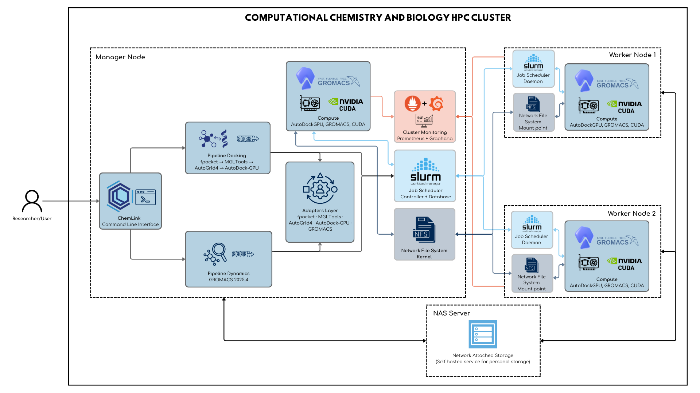

# Instalación y Despliegue — ChemLink

---

## 1. Descripción general de la solución

ChemLink es una plataforma de orquestación científica para flujos de **docking molecular** y **dinámica molecular** en entornos HPC. Opera como capa intermedia entre el investigador y las herramientas de química computacional (AutoDock-GPU, GROMACS, fpocket, MGLTools), exponiendo una CLI unificada que abstrae la complejidad de la gestión de clúster, la asignación de GPUs y la coordinación de etapas.

La plataforma puede ejecutarse en tres configuraciones:

| Modo | Descripción |
|---|---|
| **Nodo único local** | CLI directa sobre una estación con GPU, sin SLURM |
| **HPC nativo** | Generación automática de scripts SLURM sobre almacenamiento NFS compartido |
| **Contenedor** | Imagen Docker/Apptainer autocontenida, invocable desde SLURM o localmente |

---

### 1.1 Lenguajes y tecnologías utilizadas

| Capa | Tecnología | Versión |
|---|---|---|
| Lenguaje principal | Python | 3.10 |
| CLI y salida | Rich, argparse | ≥ 13.0 |
| Química computacional | RDKit, PDBFixer, OpenBabel | conda-forge |
| Preparación de estructuras | MGLTools (AutoDock Tools) | 1.5.7 (Python 2.7) |
| Preparación de topologías | ACPYPE / AmberTools | conda-forge |
| Detección de sitios activos | fpocket | 4.x |
| Mapas de afinidad | AutoGrid4 | 4.2 |
| Docking molecular | AutoDock-GPU | HEAD (CUDA) |
| Dinámica molecular | GROMACS | 2025.4 |
| Aceleración GPU | NVIDIA CUDA | 12.x |
| Paralelismo MPI | OpenMPI | ≥ 4.1 |
| Gestión de entornos | Miniconda / Conda | latest |
| Gestor de colas | SLURM | ≥ 23.x |
| Módulos de entorno | Lmod | ≥ 8.x |
| Almacenamiento en red | NFS v4 / OpenMediaVault | — |
| Contenedores | Docker / Apptainer (Singularity) | ≥ 24 / ≥ 1.3 |
| Monitoreo | Prometheus + Grafana | — |

---

### 1.2 Componentes de la solución

```
chemlink/
├── cli/                  # Punto de entrada unificado (chemlink doctor / docking / dynamics / hpc)
├── pipelines/
│   ├── docking/          # Orquestador del pipeline completo de docking
│   └── dynamics/         # Orquestador del pipeline completo de dinámica molecular
├── adapters/             # Wrappers sobre binarios externos (fpocket, AutoGrid4, AutoDock-GPU, GROMACS)
├── hpc/
│   ├── cluster/          # Detección de recursos (CPU, GPU, red, SLURM)
│   └── slurm/
│       ├── native/       # Scripts SLURM para ejecución nativa sobre NFS
│       └── container/    # Scripts SLURM para ejecución con Docker/Apptainer
├── storage/              # Gestión de rutas, directorios de corrida y NAS
├── utils/                # Logger, reintento exponencial, progreso, procesadores moleculares
├── data/
│   ├── input/            # Receptores y ligandos de entrada
│   └── output/           # Resultados por corrida (run_<timestamp>_<id>/)
├── Dockerfile            # Imagen autocontenida con CUDA + GROMACS + AutoDock-GPU
├── docker-compose.yml    # Compose con soporte GPU para desarrollo local
└── install.sh            # Instalador curl-pipe-bash
```

---

## 2. Requisitos previos

### 2.1 Software requerido

#### Sistema operativo

- **Ubuntu 24.04 LTS** (recomendado; probado en producción)
- Ubuntu 22.04 LTS (compatible con advertencias)
- Arquitectura: `x86_64`

#### GPU y drivers

> ChemLink puede ejecutarse en CPU, pero AutoDock-GPU y el offloading de GROMACS requieren GPU NVIDIA.

| Requisito | Mínimo | Recomendado |
|---|---|---|
| Driver NVIDIA | 535.x | 570.x |
| CUDA Toolkit | 12.0 | 12.4 |
| VRAM por nodo | 8 GB (RTX 3060) | 16 GB (RTX 4080 / A4000) |
| Arquitectura CUDA | sm_86 (Ampere) | sm_89/sm_90 (Ada / Hopper) |

Verificar driver instalado:

```bash
nvidia-smi
nvcc --version
```

#### Dependencias del sistema (sin Docker)

```bash
sudo apt-get update && sudo apt-get install -y \
  git curl wget build-essential cmake autoconf automake libtool \
  openmpi-bin libopenmpi-dev libfftw3-dev libfftw3-mpi-dev \
  libeigen3-dev libxml2-dev libx11-dev libxt-dev libqhull-dev \
  libnetcdf-dev zlib1g-dev python3 python3-pip python2
```

#### Docker (para instalación con contenedores)

- Docker Engine ≥ 24.0 con [NVIDIA Container Toolkit](https://docs.nvidia.com/datacenter/cloud-native/container-toolkit/install-guide.html)
- Docker Compose v2 (`docker compose version`)

Instalar NVIDIA Container Toolkit:

```bash
curl -fsSL https://nvidia.github.io/libnvidia-container/gpgkey | \
  sudo gpg --dearmor -o /usr/share/keyrings/nvidia-container-toolkit-keyring.gpg
curl -s -L https://nvidia.github.io/libnvidia-container/stable/deb/nvidia-container-toolkit.list | \
  sudo tee /etc/apt/sources.list.d/nvidia-container-toolkit.list
sudo apt-get update && sudo apt-get install -y nvidia-container-toolkit
sudo nvidia-ctk runtime configure --runtime=docker
sudo systemctl restart docker
```

Verificar acceso GPU en Docker:

```bash
docker run --rm --gpus all nvidia/cuda:12.4.0-base-ubuntu24.04 nvidia-smi
```

#### SLURM (para despliegue en clúster)

- `slurmctld` activo en el nodo manager
- `slurmd` activo en todos los nodos worker
- Nodos declarados en `/etc/slurm/slurm.conf`
- Lmod instalado en `/usr/share/lmod/` para módulos de entorno

---

### 2.2 Variables de entorno

Las siguientes variables controlan el comportamiento de los pipelines. Pueden exportarse antes de ejecutar `chemlink` o declararse en los scripts SLURM.

#### Rutas principales

| Variable | Default | Descripción |
|---|---|---|
| `REPO_DIR` | `/nfs/chemlink/chemlink` | Raíz del código fuente |
| `RUN_DIR` | `/nfs/chemlink/runs/<RUN_ID>` | Directorio de la corrida activa |
| `INPUT_RECEPTORS_DIR` | `$REPO_DIR/data/input/receptors` | PDB de receptores de entrada |
| `INPUT_LIGANDS_DIR` | `$REPO_DIR/data/input/ligands` | Mol2/SDF/PDBQT de ligandos |
| `OUTPUT_DIR` | `$RUN_DIR/output` | Artefactos generados |
| `PYTHONPATH` | `/nfs/chemlink:$PYTHONPATH` | Para importar el paquete |

#### Herramientas externas

| Variable | Default | Descripción |
|---|---|---|
| `PYTHON_BIN` | `/nfs/chemlink/miniconda/envs/bio/bin/python` | Intérprete del entorno `bio` |
| `MGLTOOLS_PATH` | `/nfs/chemlink/miniconda/envs/mgl_legacy` | Prefijo del entorno MGLTools |
| `FPOCKET_PATH` | `/usr/local/bin/fpocket` | Ejecutable de fpocket |
| `AUTOGRID_EXECUTABLE` | `/usr/local/bin/autogrid4` | Ejecutable de AutoGrid4 |
| `AUTODOCK_GPU_EXECUTABLE` | `/usr/local/bin/autodock-gpu` | Ejecutable de AutoDock-GPU |
| `GMXRC` | `/usr/local/gromacs/bin/GMXRC` | Script de inicialización de GROMACS |

#### GPU y paralelismo

| Variable | Default | Descripción |
|---|---|---|
| `NVIDIA_VISIBLE_DEVICES` | `all` | GPUs accesibles (ej. `0,1` para limitar) |
| `CUDA_VISIBLE_DEVICES` | — | Override por tarea en SLURM array |
| `NVIDIA_DRIVER_CAPABILITIES` | `compute,utility` | Capacidades del driver en contenedores |
| `PYTHONUNBUFFERED` | `1` | Logs en tiempo real en contenedores |

#### SLURM (pipelines distribuidos)

| Variable | Default | Descripción |
|---|---|---|
| `SLURM_PARTITION` | *(default)* | Partición del clúster |
| `SLURM_NODELIST` | — | Lista de nodos (ej. `worker01,worker02`) |
| `SLURM_ACCOUNT` | — | Cuenta de proyecto SLURM |
| `SLURM_QOS` | — | Clase de servicio |
| `MAX_GPU_CONCURRENCY` | `6` | Tareas SLURM concurrentes con GPU |
| `BATCH_SIZE` | `200` | Ligandos por lote en Job Array |
| `DYN_TIME_LIMIT` | `72:00:00` | Wall time para dinámicas SLURM |
| `DYN_TYPE` | `pligand` | Tipo de simulación dinámica |
| `DYN_NS_TIME` | `100` | Nanosegundos de producción |
| `DYN_CHARGE` | `0` | Carga neta del ligando |

---

## 3. Instalación para ambiente de desarrollo

### 3.1 Desarrollo sin contenedores

#### 3.1.1 Clonar el repositorio

```bash
git clone https://github.com/PipeJF9/chemlink.git
cd chemlink
```

O con el instalador automático:

```bash
curl -fsSL https://raw.githubusercontent.com/PipeJF9/chemlink/main/install.sh | bash
```

#### 3.1.2 Instalar dependencias

**Miniconda** (si no está instalado):

```bash
wget https://repo.anaconda.com/miniconda/Miniconda3-latest-Linux-x86_64.sh -O /tmp/miniconda.sh
bash /tmp/miniconda.sh -b -p /opt/miniconda
export PATH=/opt/miniconda/bin:$PATH
```

**Entorno principal `bio`** (Python 3.10 + stack científico):

```bash
conda create -n bio -y --override-channels -c conda-forge \
  python=3.10 pip \
  ambertools acpype openbabel pdbfixer rdkit \
  tqdm pandas numpy rich biopython
conda activate bio
```

**Entorno legado `mgl_legacy`** (Python 2.7 + MGLTools):

```bash
conda create -n mgl_legacy -y python=2.7
# Instalar MGLTools desde tarball
wget https://ccsb.scripps.edu/download/532/ -O /tmp/mgltools.tar.gz
sudo mkdir -p /opt/mgltools
sudo tar -xzf /tmp/mgltools.tar.gz -C /opt/mgltools --strip-components=1
(cd /opt/mgltools && sudo bash install.sh -d /opt/mgltools) || true
sudo ln -sf /opt/mgltools/bin/pythonsh /usr/local/bin/pythonsh
```

**Herramientas científicas** (fpocket, AutoGrid4, AutoDock4):

```bash
# fpocket
git clone https://github.com/Discngine/fpocket.git /tmp/fpocket
cd /tmp/fpocket && git checkout 4.0 && sed -i 's/-Werror//g' makefile
make -j$(nproc) && sudo find bin -type f -executable -exec cp {} /usr/local/bin/ \;

# AutoGrid4 + AutoDock4
git clone https://github.com/ccsb-scripps/AutoGrid.git /tmp/autogrid
cd /tmp/autogrid && autoreconf -i && ./configure --prefix=/usr/local
make -j$(nproc) && sudo make install
sudo mv /usr/local/bin/autogrid /usr/local/bin/autogrid4 2>/dev/null || true

git clone --depth 1 https://github.com/ccsb-scripps/AutoDock4.git /tmp/autodock4
cd /tmp/autodock4 && autoreconf -i && ./configure --prefix=/usr/local
make -j$(nproc) && sudo make install
```

**AutoDock-GPU** (requiere CUDA):

> Las arquitecturas objetivo cubren las GPUs del laboratorio:
> `sm_89` = RTX 4070/4090 (Ada Lovelace) | `sm_90` = H100 (Hopper) | `sm_120` = RTX 5000 (Blackwell)

```bash
git clone https://github.com/ccsb-scripps/AutoDock-GPU.git /tmp/autodock-gpu
cd /tmp/autodock-gpu
export NVCCFLAGS="-O3 --use_fast_math -Xptxas -O3 \
  -gencode arch=compute_86,code=sm_86 \
  -gencode arch=compute_89,code=sm_89 \
  -gencode arch=compute_90,code=sm_90 \
  -gencode arch=compute_120,code=sm_120 \
  -gencode arch=compute_120,code=compute_120"
make DEVICE=CUDA NUMWI=128 CUDA_PATH=/usr/local/cuda -j$(nproc)
sudo cp bin/autodock_gpu_128wi /usr/local/bin/autodock-gpu
sudo chmod +x /usr/local/bin/autodock-gpu
```

**GROMACS 2025.4** (requiere CUDA + OpenMPI, ~30–60 min):

```bash
wget https://ftp.gromacs.org/gromacs/gromacs-2025.4.tar.gz -O /tmp/gromacs.tar.gz
tar -xzf /tmp/gromacs.tar.gz -C /tmp && cd /tmp/gromacs-2025.4 && mkdir build && cd build
cmake .. \
  -DGMX_BUILD_OWN_FFTW=ON \
  -DGMX_GPU=CUDA \
  -DGMX_MPI=ON \
  -DGMX_SIMD=AVX2_256 \
  -DCMAKE_INSTALL_PREFIX=/usr/local/gromacs \
  -DGMX_CUDA_TARGET_SM="75;80;86;89;90;100;120" \
  -DGMX_CUDA_TARGET_COMPUTE="90"
make -j$(nproc) && sudo make install
echo "source /usr/local/gromacs/bin/GMXRC" >> ~/.bashrc
```

#### 3.1.3 Configurar variables de entorno

Crear un archivo `~/.chemlink_env` (o añadir al `.bashrc`):

```bash
# ChemLink environment
export REPO_DIR=/opt/chemlink
export PYTHONPATH="${REPO_DIR}:${PYTHONPATH:-}"
export MGLTOOLS_PATH=/opt/mgltools
export FPOCKET_PATH=/usr/local/bin/fpocket
export AUTOGRID_EXECUTABLE=/usr/local/bin/autogrid4
export AUTODOCK_GPU_EXECUTABLE=/usr/local/bin/autodock-gpu
source /usr/local/gromacs/bin/GMXRC
```

#### 3.1.4 Ejecutar servicios requeridos

Para desarrollo multinodo, verificar que NFS esté montado en todos los nodos:

```bash
# En el manager (OpenMediaVault ya configurado)
showmount -e localhost

# En cada worker
sudo mount -t nfs4 <manager-ip>:/nfs/chemlink /nfs/chemlink
# Añadir a /etc/fstab para persistencia:
# <manager-ip>:/nfs/chemlink  /nfs/chemlink  nfs4  defaults  0  0
```

Verificar SLURM (desarrollo multinodo):

```bash
sinfo          # estado de particiones
squeue         # trabajos en cola
```

#### 3.1.5 Iniciar la aplicación

```bash
conda activate bio
export PYTHONPATH=/opt/chemlink:${PYTHONPATH:-}

# Diagnóstico del entorno
chemlink doctor

# Pipeline de docking (nodo único)
chemlink docking full \
  --receptor data/input/receptors/proteina.pdb \
  --ligands  data/input/ligands/ \
  --output   data/output/ \
  --cpus 8 --gpus 1

# Pipeline de dinámica molecular
chemlink dynamics full \
  --receptor data/input/receptors/proteina.pdb \
  --ligand   data/input/ligands/ligando.mol2 \
  --type pligand --time 100 --cpus 8
```

---

### 3.2 Desarrollo con contenedores

#### 3.2.1 Construcción de contenedores

La imagen incluye todo el stack: CUDA, Miniconda, GROMACS, AutoDock-GPU, fpocket y MGLTools.

```bash
# Construir imagen (primera vez: ~60–90 min por compilaciones)
docker build -t chemlink:latest .

# Etiquetar con versión
docker build -t chemlink:1.0.0 .
```

> **Consideraciones de GPU en la imagen:**
> La imagen base es `nvidia/cuda:13.0.0-devel-ubuntu24.04`. AutoDock-GPU se compila con soporte para `sm_89`, `sm_90` y `sm_120`. GROMACS se compila con soporte para `sm_75`–`sm_120`. El driver del host debe ser compatible con la versión de CUDA de la imagen.

#### 3.2.2 Ejecución del entorno

```bash
# Levantar el servicio con GPU
docker compose up -d

# Acceder al shell del contenedor
docker compose exec chemlink-gpu bash

# Dentro del contenedor: verificar entorno
chemlink doctor
```

Ejecución directa sin `docker compose`:

```bash
docker run --rm --gpus all \
  -v "$(pwd)":/app/chemlink \
  -e NVIDIA_VISIBLE_DEVICES=all \
  chemlink:latest \
  chemlink doctor
```

#### 3.2.3 Servicios disponibles

| Servicio | Descripción | Red interna |
|---|---|---|
| `chemlink-gpu` | Contenedor principal con CUDA + todas las herramientas | `chemlink-network` |

El volumen `./:/app/chemlink` monta el código fuente en tiempo real, por lo que los cambios de código se reflejan inmediatamente sin reconstruir la imagen.

#### 3.2.4 Apagado del entorno

```bash
docker compose down
# Para eliminar también la imagen construida:
docker compose down --rmi local
```

---

## 4. Despliegue

### 4.1 Arquitectura de despliegue



El volumen NFS `/nfs/chemlink` contiene:
- `/nfs/chemlink/chemlink/` — código fuente y módulo Lmod
- `/nfs/chemlink/miniconda/` — entornos Conda compartidos
- `/nfs/chemlink/runs/` — corridas y resultados
- `/nfs/chemlink/software/` — binarios compilados (opcional)
- `/nfs/chemlink/modules/` — módulos Lmod

---

### 4.2 Proceso de actualización

```bash
# Actualización de ChemLink (sin afectar entornos Conda ni datos)
cd /nfs/chemlink/chemlink
git pull origin main

# O con el instalador (detecta instalación existente y hace pull):
curl -fsSL https://raw.githubusercontent.com/PipeJF9/chemlink/main/install.sh | bash
```

---

### 4.3 Despliegue sin contenedores (nativo sobre NFS + SLURM)

#### 4.3.1 Preparación del servidor

En el **nodo manager**, ejecutar una sola vez:

```bash
# 1. Instalar ChemLink con todas las herramientas en NFS
curl -fsSL https://raw.githubusercontent.com/PipeJF9/chemlink/main/install.sh | \
  bash -s -- --full --dir /nfs/chemlink/chemlink

# 2. Verificar que NFS esté exportado
cat /etc/exports
# Debe incluir: /nfs/chemlink  10.0.0.0/24(rw,sync,no_subtree_check)

# 3. Verificar SLURM
sinfo -l
```

En cada **nodo worker**:

```bash
# Montar NFS (si no está en /etc/fstab)
sudo mount -t nfs4 10.0.0.1:/nfs/chemlink /nfs/chemlink

# Verificar que slurmd esté activo
sudo systemctl status slurmd
```

#### 4.3.2 Instalación de dependencias

Al instalar con `--full --dir /nfs/chemlink/chemlink`, el script compila todos los binarios en el host del manager. Para que los workers puedan usar los mismos binarios:

**Opción A** — binarios en NFS (recomendada):

```bash
# Los binarios compilados se copian al volumen NFS
sudo mkdir -p /nfs/chemlink/software/bin
sudo cp /usr/local/bin/{fpocket,autogrid4,autodock4,autodock-gpu} \
        /nfs/chemlink/software/bin/
# Exportar en cada nodo:
export PATH=/nfs/chemlink/software/bin:$PATH
```

**Opción B** — compilar en cada worker:

```bash
# Re-ejecutar el instalador en cada worker
curl -fsSL https://raw.githubusercontent.com/PipeJF9/chemlink/main/install.sh | \
  bash -s -- --full --skip-conda
```

#### 4.3.3 Configuración de la aplicación

Registrar el módulo Lmod (ejecutar en el manager, efecto inmediato en todos los nodos vía NFS):

```bash
sudo mkdir -p /nfs/chemlink/modules/chemlink
sudo tee /nfs/chemlink/modules/chemlink/1.0.lua <<'EOF'
help([[ ChemLink v1.0 — Molecular Orchestration Platform ]])
whatis("Name: ChemLink")
whatis("Version: 1.0")

prepend_path("PATH",       "/nfs/chemlink/software/bin:/nfs/chemlink/chemlink")
prepend_path("PYTHONPATH", "/nfs/chemlink")
setenv("CHEMLINK_HOME",    "/nfs/chemlink/chemlink")
setenv("PYTHON_BIN",       "/nfs/chemlink/miniconda/envs/bio/bin/python")
setenv("MGLTOOLS_PATH",    "/nfs/chemlink/miniconda/envs/mgl_legacy")
EOF
```

#### 4.3.4 Ejecución de la aplicación

**Modo nodo único** (sin SLURM):

```bash
module load chemlink/1.0
chemlink docking full \
  --receptor /nfs/chemlink/chemlink/data/input/receptors/receptor.pdb \
  --ligands  /nfs/chemlink/chemlink/data/input/ligands/ \
  --cpus 8 --gpus 1
```

**Modo HPC con SLURM** (docking multinodo):

```bash
module load chemlink/1.0
export INPUT_RECEPTORS_DIR=/nfs/chemlink/chemlink/data/input/receptors
export INPUT_LIGANDS_DIR=/nfs/chemlink/chemlink/data/input/ligands
export MAX_GPU_CONCURRENCY=6
export BATCH_SIZE=200
export SLURM_PARTITION=gpu

bash /nfs/chemlink/chemlink/hpc/slurm/native/run_multinode_pipeline.sh
```

**Modo HPC con SLURM** (dinámica molecular):

```bash
module load chemlink/1.0
export DYN_TYPE=pligand
export DYN_NS_TIME=100
export DYN_CHARGE=0
export DYN_TIME_LIMIT=08:00:00
export DYN_CONFIGS_JSON=/nfs/chemlink/runs/sim_batch/configs.json

bash /nfs/chemlink/chemlink/hpc/slurm/native/run_dynamics_pipeline.sh
```

#### 4.3.5 Actualización de versiones

```bash
cd /nfs/chemlink/chemlink
git fetch origin
git checkout main && git pull
# Los workers verán el cambio inmediatamente vía NFS — no requieren acción adicional.
```

---

### 4.4 Despliegue con contenedores

#### 4.4.1 Construcción de imágenes

```bash
cd /nfs/chemlink/chemlink

# Build local
docker build -t chemlink:1.0.0 .
docker tag chemlink:1.0.0 chemlink:latest

# Build con BuildKit (más rápido, caché por capa)
DOCKER_BUILDKIT=1 docker build \
  --cache-from chemlink:latest \
  -t chemlink:1.0.0 .
```

> **Nota sobre GPU en la imagen:**
> La imagen compila AutoDock-GPU con targets `sm_89`, `sm_90` y `sm_120`. Si tu GPU es anterior (Ampere, `sm_86`), edita `Dockerfile` y añade `arch=compute_86,code=sm_86` en la variable `NVCCFLAGS` antes de construir.
> GROMACS se compila con targets `sm_75;80;86;89;90;100;120` para máxima compatibilidad.

**Para Apptainer/Singularity** (HPC sin privilegios Docker):

```bash
# Convertir imagen Docker a SIF
apptainer build chemlink.sif docker-daemon://chemlink:latest

# O construir directamente desde Dockerfile
apptainer build chemlink.sif docker://chemlink:latest
```

#### 4.4.2 Ejecución en servidor

**Docker Compose** (desarrollo y servidor único):

```bash
docker compose up -d
docker compose exec chemlink-gpu bash
# O ejecutar directamente:
docker compose run --rm chemlink-gpu chemlink doctor
```

**Docker directo** con GPU explícita:

```bash
# Todas las GPUs
docker run --rm --gpus all \
  -v /nfs/chemlink:/nfs/chemlink \
  -w /nfs/chemlink/chemlink \
  -e PYTHONPATH=/nfs/chemlink \
  chemlink:latest \
  chemlink docking full --receptor ... --ligands ...

# GPU específica (índice 0)
docker run --rm --gpus '"device=0"' \
  -v /nfs/chemlink:/nfs/chemlink \
  chemlink:latest chemlink doctor
```

**Apptainer en nodos SLURM** (sin privilegios root):

```bash
# Ejecución interactiva
apptainer exec --nv \
  --bind /nfs/chemlink:/nfs/chemlink \
  /nfs/chemlink/chemlink.sif \
  chemlink doctor

# Desde script SLURM — usar variable CONTAINER_IMAGE:
export CONTAINER_IMAGE=/nfs/chemlink/chemlink.sif
export CONTAINER_RUNTIME=apptainer
bash /nfs/chemlink/chemlink/hpc/slurm/native/run_multinode_pipeline.sh
```

Los scripts SLURM detectan automáticamente `CONTAINER_RUNTIME=apptainer|singularity|docker` y adaptan el comando de invocación.

#### 4.4.3 Variables de entorno y secretos

Pasar variables al contenedor con `-e` o un archivo `.env`:

```bash
# Archivo .env (no commitear)
cat > .env <<EOF
NVIDIA_VISIBLE_DEVICES=all
NVIDIA_DRIVER_CAPABILITIES=compute,utility
PYTHONUNBUFFERED=1
REPO_DIR=/nfs/chemlink/chemlink
PYTHON_BIN=/opt/miniconda/envs/bio/bin/python
MGLTOOLS_PATH=/opt/mgltools
EOF

docker run --rm --gpus all --env-file .env \
  -v /nfs/chemlink:/nfs/chemlink \
  chemlink:latest chemlink docking full ...
```

Con Docker Compose, añadir al servicio:

```yaml
environment:
  - NVIDIA_VISIBLE_DEVICES=all
  - PYTHONUNBUFFERED=1
  - REPO_DIR=/app/chemlink
```

#### 4.4.4 Persistencia y redes

El contenedor no persiste datos por defecto. Montar siempre el volumen NFS o el directorio de datos:

```yaml
# docker-compose.yml
services:
  chemlink-gpu:
    volumes:
      - ./:/app/chemlink:z           # código fuente (desarrollo)
      - /nfs/chemlink/runs:/nfs/chemlink/runs   # resultados persistentes
      - /nfs/chemlink/data:/nfs/chemlink/data   # datos de entrada
```

Para redes en clúster con múltiples contenedores:

```yaml
networks:
  chemlink-network:
    driver: bridge
    ipam:
      config:
        - subnet: 172.28.0.0/16
```

#### 4.4.5 Actualización del despliegue

```bash
# 1. Bajar el servicio
docker compose down

# 2. Actualizar código
git -C /nfs/chemlink/chemlink pull origin main

# 3. Reconstruir imagen (solo si cambió el Dockerfile o dependencias)
docker build -t chemlink:latest .

# 4. Subir el servicio
docker compose up -d

# Actualizar imagen SIF para Apptainer
apptainer build --force chemlink.sif docker-daemon://chemlink:latest
```

---

## 5. Verificación de funcionamiento

```bash
# Diagnóstico completo del entorno
chemlink doctor
```

La salida reporta el estado de cada componente:

| Verificación | Comando de verificación manual |
|---|---|
| Python 3.10 en `bio` | `conda run -n bio python --version` |
| MGLTools / pythonsh | `pythonsh -v` |
| fpocket | `fpocket --help 2>&1 \| head -1` |
| AutoGrid4 | `autogrid4 -h 2>&1 \| head -1` |
| AutoDock-GPU | `autodock-gpu --version` |
| GROMACS (MPI) | `gmx_mpi --version \| head -5` |
| CUDA disponible | `nvidia-smi --query-gpu=name --format=csv,noheader` |
| NFS montado | `mount \| grep nfs` |
| SLURM activo | `sinfo -l` |
| Contenedor GPU | `docker run --rm --gpus all nvidia/cuda:12.4.0-base-ubuntu24.04 nvidia-smi` |

Prueba funcional mínima de docking (sin GPU):

```bash
chemlink docking prepare-receptor \
  --input data/input/receptors/receptor.pdb \
  --output /tmp/test_receptor/
```

Prueba funcional de dinámica (sin GPU, sistema pequeño):

```bash
chemlink dynamics full \
  --receptor data/input/receptors/proteina.pdb \
  --type oprotein --time 1 --cpus 4 --no-gpu
```

---

## 6. Solución de problemas frecuentes

### GPU no detectada en Docker

```
docker: Error response from daemon: could not select device driver "" with capabilities: [[gpu]]
```

**Solución:**
```bash
sudo nvidia-ctk runtime configure --runtime=docker
sudo systemctl restart docker
# Verificar:
docker info | grep -i runtime
```

### AutoDock-GPU: `illegal instruction` o `CUDA error: no kernel image`

La GPU del host tiene una arquitectura distinta a las compiladas en la imagen.

**Solución:** reconstruir con el `sm_` correcto:
```bash
# Verificar compute capability del host
nvidia-smi --query-gpu=compute_cap --format=csv,noheader
# Editar Dockerfile: añadir -gencode arch=compute_XX,code=sm_XX
DOCKER_BUILDKIT=1 docker build -t chemlink:latest .
```

### GROMACS: `JIT PTX compilation` lento (RTX 5000 / sm_120)

El binario no incluye código nativo para sm_120 y compila en tiempo de ejecución.

**Solución:** asegurar que la compilación incluyó `sm_120` o usar el compilado en el Dockerfile (que sí lo incluye). Ver también el apartado de la memoria de proyecto sobre mitigación con `nstlist=40`.

### NFS: `mount: connection timed out`

```bash
# Verificar que el servidor NFS esté activo
sudo systemctl status nfs-kernel-server   # en el manager
sudo exportfs -v                          # verificar exports
# Verificar firewall
sudo ufw status
sudo ufw allow from 10.0.0.0/24 to any port 2049
```

### SLURM: `job cancelled — time limit`

Aumentar el tiempo límite para dinámicas complejas:
```bash
export DYN_TIME_LIMIT=12:00:00   # para pprotein o ppligand
bash hpc/slurm/native/run_dynamics_pipeline.sh
```

### `ModuleNotFoundError: No module named 'chemlink'`

```bash
export PYTHONPATH=/nfs/chemlink/chemlink:${PYTHONPATH:-}
# O cargar el módulo:
module load chemlink/1.0
```

### Ligando no procesado por AutoDock-GPU (geometría anómala)

El sistema registra el fallo en `runs/<id>/logs/` y continúa. Para inspeccionar:
```bash
grep "ERROR\|FAILED" /nfs/chemlink/runs/<run_id>/logs/*.err
```

---

## 7. Mantenimiento y actualización

### Actualizar ChemLink

```bash
# Sin Docker
git -C /nfs/chemlink/chemlink pull origin main

# Con Docker (reconstruir solo si cambió Dockerfile o requirements)
git -C /nfs/chemlink/chemlink pull origin main
docker build -t chemlink:latest /nfs/chemlink/chemlink
docker compose up -d
```

### Actualizar entornos Conda

```bash
conda activate bio
conda update --all -c conda-forge
# Actualizar dependencias Python del proyecto
pip install --upgrade -r /nfs/chemlink/chemlink/requirements.txt
```

### Limpiar corridas antiguas

```bash
# Eliminar corridas con más de 30 días
find /nfs/chemlink/runs -maxdepth 1 -type d -mtime +30 -exec rm -rf {} +
```

### Monitoreo del clúster

- **Grafana:** `http://<manager-ip>:3000` — dashboards de CPU, GPU, RAM y red por nodo
- **Prometheus:** `http://<manager-ip>:9090` — métricas brutas y alertas
- **SLURM:** `squeue -u $USER` — trabajos activos; `sacct -j <jobid>` — historial

### Copias de seguridad

Los resultados en `/nfs/chemlink/runs/` se respaldan automáticamente mediante las instantáneas de OpenMediaVault (SMB/CIFS). Para backup manual:

```bash
rsync -av /nfs/chemlink/runs/ /backup/chemlink-runs/
```

---

## 8. Referencias relacionadas

| Recurso | Descripción |
|---|---|
| [README.md](../README.md) | Descripción general del proyecto y inicio rápido |
| [docs/Instalación.md](Instalación.md) | Este documento |
| [Informe.md](../Informe.md) | Informe técnico completo del proyecto |
| [hpc/slurm/native/](../hpc/slurm/native/) | Scripts SLURM para despliegue nativo |
| [hpc/slurm/container/](../hpc/slurm/container/) | Scripts SLURM para despliegue con contenedores |
| [Dockerfile](../Dockerfile) | Imagen Docker autocontenida |
| [docker-compose.yml](../docker-compose.yml) | Compose para desarrollo con GPU |
| [install.sh](../install.sh) | Instalador curl-pipe-bash |
| [NVIDIA Container Toolkit](https://docs.nvidia.com/datacenter/cloud-native/container-toolkit/install-guide.html) | Guía oficial GPU en Docker |
| [SLURM Job Arrays](https://slurm.schedmd.com/job_array.html) | Documentación oficial de SLURM |
| [GROMACS GPU offloading](https://manual.gromacs.org/current/user-guide/mdrun-performance.html) | Configuración de GROMACS con GPU |
| [AutoDock-GPU](https://github.com/ccsb-scripps/AutoDock-GPU) | Repositorio oficial |
